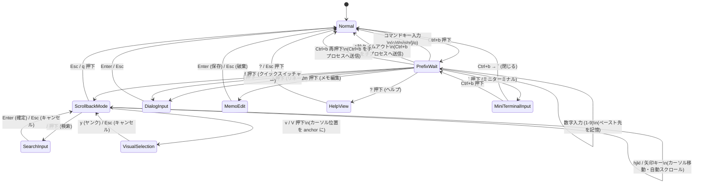
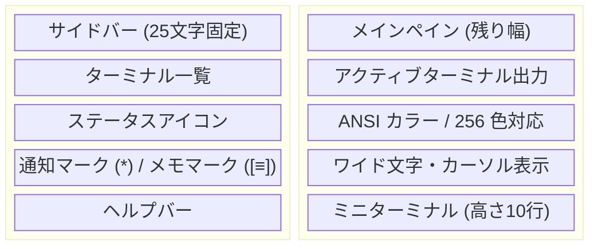
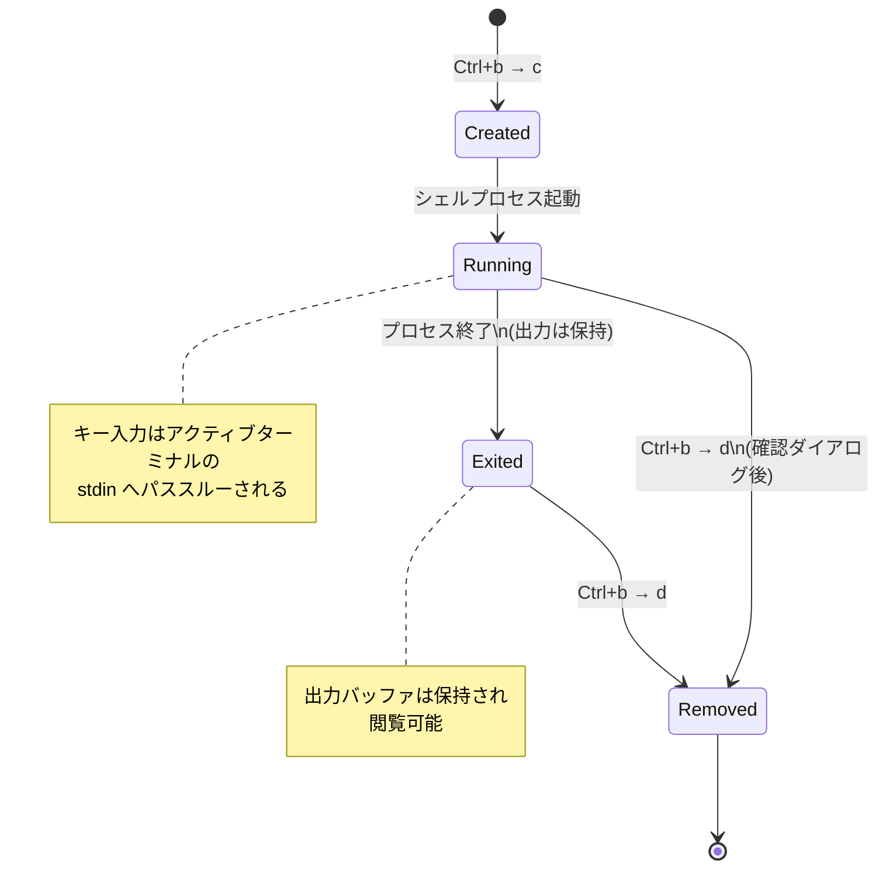
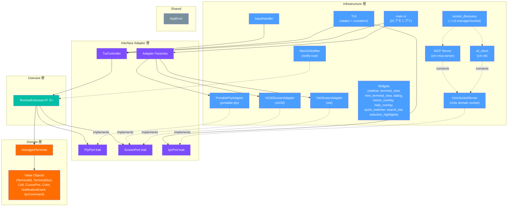
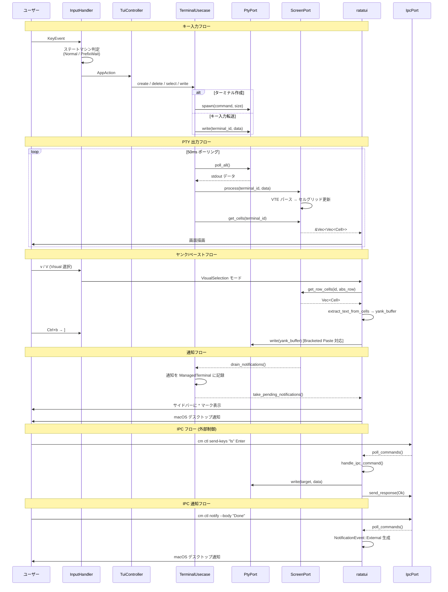
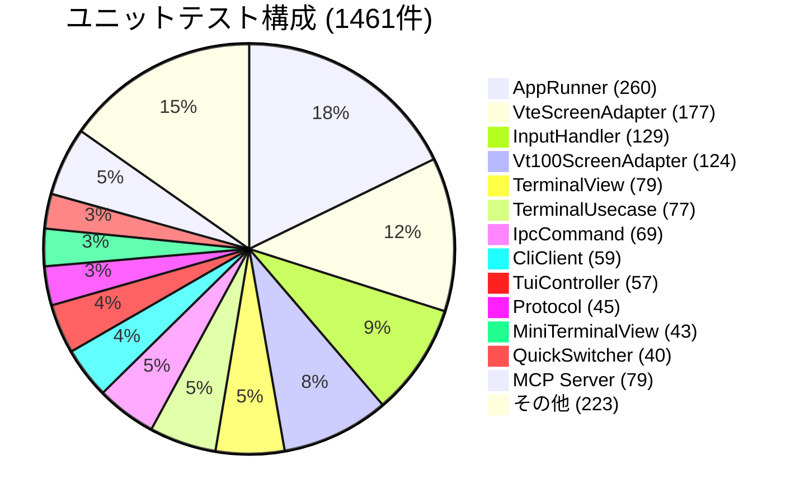

# CLI Manager

TUI ベースのターミナルマルチプレクサ。複数の CLI プロセス（例: Claude Code）を擬似端末（PTY）で管理し、2 ペインの TUI インターフェースで切り替えながら操作できる、"CLI プロセス用ウィンドウマネージャ" です。

## 目次

- [機能](#機能)
- [必要環境](#必要環境)
- [インストール](#インストール)
- [クイックスタート](#クイックスタート)
- [操作方法](#操作方法)
  - [キーバインド一覧](#キーバインド一覧)
  - [Visual 選択モード（ヤンクバッファ）](#visual-選択モードヤンクバッファ)
  - [クイックスイッチャー](#クイックスイッチャー)
  - [ミニターミナル](#ミニターミナル)
  - [プレフィックスキーの仕組み](#プレフィックスキーの仕組み)
- [UI レイアウト](#ui-レイアウト)
- [ターミナルのライフサイクル](#ターミナルのライフサイクル)
- [アーキテクチャ](#アーキテクチャ)
  - [レイヤー構成](#レイヤー構成)
  - [データフロー](#データフロー)
  - [ディレクトリ構成](#ディレクトリ構成)
- [開発](#開発)
  - [ビルド & テスト](#ビルド--テスト)
  - [テスト構成](#テスト構成)
- [IPC（ウィンドウ間通信）](#ipcウィンドウ間通信)
  - [ソケットディスカバリ](#ソケットディスカバリ)
  - [CLI コマンド一覧](#cli-コマンド一覧)
  - [AI エージェント連携](#ai-エージェント連携)
- [MCP Server](#mcp-server)
  - [セットアップ](#セットアップ)
  - [利用可能なツール](#利用可能なツール)
- [技術スタック](#技術スタック)
- [ライセンス](#ライセンス)

## 機能

| 機能 | 説明 |
|------|------|
| ターミナル作成 | 新しいシェルセッションを PTY 上で起動 |
| ターミナル切替 | 番号指定・前後移動でアクティブターミナルを切り替え |
| リアルタイム出力 | ANSI カラー/エスケープシーケンスを解釈して描画 |
| サイドバー | 全ターミナルの一覧・ステータス・動的 CWD を常時表示 |
| ターミナル削除 | 実行中プロセスの場合は確認ダイアログ付き |
| プレフィックスキー | tmux ライクな `Ctrl+b` プレフィックスモデル |
| 256 色 & 属性 | xterm-256color、太字/イタリック/下線/取り消し線/反転/薄字 |
| 代替画面バッファ | vim 等のフルスクリーンアプリケーション対応 |
| スクロールリージョン | DECSTBM による部分スクロール |
| ワイド文字 | CJK 文字（全角）の正確な表示 |
| アプリケーションカーソルキー | DECCKM モード対応 |
| ブラケットペースト | ペースト時のエスケープシーケンスラッピング |
| OSC 7 動的 CWD | シェルの現在ディレクトリをサイドバーに反映 |
| 通知 | BEL / OSC 9 / OSC 777 検出 → サイドバーマーク + macOS デスクトップ通知。IPC 経由の外部通知にも対応（Claude Code Hooks 連携） |
| スクロールバック | 出力履歴を vim ライクなカーソル移動で自由に閲覧（10,000 行バッファ）。`hjkl`・矢印キーでカーソルを上下左右に移動し、行ハイライトで現在位置を表示 |
| スクロールバック検索 | `/` でインクリメンタル検索。`n` / `N` でマッチ間ジャンプ。メイン・ミニターミナル両対応 |
| ヤンクバッファ | スクロールバック中に `y` でカーソル行をコピー、`Y` で全行コピー、`v` / `V` でカーソル位置から Visual 選択。`Ctrl+b` → `]` で別ターミナルにペースト |
| IPC（ウィンドウ間通信） | Unix ドメインソケットによる外部制御。`cm ctl` コマンドでキー送信・画面キャプチャ・ターミナル管理・デスクトップ通知送信。AI エージェント連携対応 |
| MCP Server | MCP（Model Context Protocol）対応。`cm mcp-server` で stdio サーバーを起動し、Claude Code 等の AI エージェントからターミナル操作・デスクトップ通知送信が可能 |
| ソケットディスカバリ | `~/.cli-manager/socket` にソケットパスを書き出し。環境変数なしでも外部プロセスから接続可能 |
| リネーム | ターミナル名を後から変更可能 |
| メモ | 各ターミナルに複数行メモを付与・編集。サイドバーに `[≡]` インジケータ表示 |
| ヘルプオーバーレイ | `Ctrl+b` → `?` でキーバインド一覧をオーバーレイ表示 |
| クイックスイッチャー | `Ctrl+b` → `f` でファジー検索オーバーレイ。名前・CWD・メモで絞り込み即座に切替 |
| ミニターミナル | フッター型クイックシェル。`` Ctrl+b `` → `` ` `` でトグル。スクロールバック対応 |

## 必要環境

- **Rust** 1.85.0 以上（edition 2024 / let-chains 構文のため）
- **OS**: macOS（Linux は将来対応予定）

## インストール

```bash
git clone <repository-url>
cd cli_manager
cargo install --path .
```

`~/.cargo/bin/cm` にインストールされます。`~/.cargo/bin` にパスが通っていれば、どこからでも `cm` で起動できます。

手動でビルドする場合:

```bash
cargo build --release
```

ビルド後のバイナリは `target/release/cm` に生成されます。

## クイックスタート

```bash
# インストール済みの場合
cm

# または cargo 経由で起動
cargo run
```

起動すると TUI が表示されます。最初のターミナルを作成するには `Ctrl+b` → `c` を押してください。

## 操作方法

### キーバインド一覧

すべての操作コマンドは **プレフィックスキー `Ctrl+b`** の後に入力します。

| キーバインド | アクション |
|---|---|
| `Ctrl+b` → `c` | 新しいターミナルを作成 |
| `Ctrl+b` → `d` | アクティブターミナルを削除（実行中なら確認あり） |
| `Ctrl+b` → `n` | 次のターミナルを選択 |
| `Ctrl+b` → `p` | 前のターミナルを選択 |
| `Ctrl+b` → `f` | クイックスイッチャーを開く（ファジー検索で切替） |
| `Ctrl+b` → `Ctrl+b` | 子プロセスに `Ctrl+b` を送信 |
| `Ctrl+b` → `[` | スクロールバックモードに入る |
| `Ctrl+b` → `r` | アクティブターミナルをリネーム |
| `Ctrl+b` → `m` | メモを編集 |
| `Ctrl+b` → `` ` `` | ミニターミナルのトグル（開く/閉じる/フォーカス切替） |
| `Ctrl+b` → `]` | ヤンクバッファの内容をペースト（Bracketed Paste 対応） |
| `Ctrl+b` → `<N>` `]` | ヤンクバッファの内容をターミナル #N にペースト |
| `Ctrl+b` → `?` | ヘルプオーバーレイを表示 |
| `Ctrl+b` → `q` | アプリケーション終了 |
| その他のキー | アクティブターミナルの stdin へパススルー |

#### スクロールバックモード

`Ctrl+b` → `[` でスクロールバックモードに入ると、出力履歴をカーソルで自由に移動しながら閲覧できます。カーソル行はグレーでハイライト表示され、vim ライクなキーバインドで操作します。

| キーバインド | アクション |
|---|---|
| `↑` / `k` | カーソルを 1 行上に移動（画面端で自動スクロール） |
| `↓` / `j` | カーソルを 1 行下に移動（画面端で自動スクロール） |
| `←` / `h` | カーソルを 1 文字左に移動 |
| `→` / `l` | カーソルを 1 文字右に移動 |
| `0` | カーソルを行頭にジャンプ |
| `$` | カーソルを行末にジャンプ |
| `PageUp` | カーソルを 1 ページ上に移動 |
| `PageDown` | カーソルを 1 ページ下に移動 |
| `g` | バッファの先頭にジャンプ |
| `G` | バッファの末尾にジャンプ |
| `Esc` / `q` | スクロールバックモードを終了 |
| `/` | 検索モードに入る（インクリメンタル検索） |
| `y` | カーソル行をヤンクバッファにコピー |
| `Y` | 表示中の全行をヤンクバッファにコピー |
| `v` | カーソル位置から Visual 文字選択モードに入る |
| `V` | カーソル位置から Visual 行選択モードに入る |
| `n` | 次のマッチにジャンプ（検索確定後） |
| `N` | 前のマッチにジャンプ（検索確定後） |
| `Enter` | 検索を確定し、`n` / `N` でのナビゲーションモードへ移行 |
| `Esc` | 検索をキャンセル（検索中は検索終了、その後もう一度で通常モードへ） |

**検索の使い方:**

1. スクロールバックモード（`Ctrl+b` → `[`）に入る
2. `/` を押して検索クエリを入力（大文字小文字を区別しない）
3. 入力中はリアルタイムでマッチ箇所がハイライト表示される
4. `Enter` で検索を確定 → `n` / `N` でマッチ間をジャンプ
5. `Esc` で検索を終了しスクロールバックモードに戻る

検索バーはメインペイン下部に表示され、`[現在/総数]` 形式でマッチ数が確認できます。メインターミナルとミニターミナルの両方で利用可能です。

#### Visual 選択モード（ヤンクバッファ）

スクロールバックモード中に `v`（文字選択）または `V`（行選択）で Visual 選択モードに入ります。tmux の copy-mode に相当する機能で、テキストを選択・コピーし、別のターミナルにペーストできます。

| キーバインド | アクション |
|---|---|
| `h` / `←` | カーソルを左に移動（Character モードのみ） |
| `l` / `→` | カーソルを右に移動（Character モードのみ） |
| `0` | 行頭にジャンプ（Character モードのみ） |
| `$` | 行末にジャンプ（Character モードのみ） |
| `j` / `↓` | カーソルを下に移動 |
| `k` / `↑` | カーソルを上に移動 |
| `PageUp` | ページ上に移動 |
| `PageDown` | ページ下に移動 |
| `y` | 選択範囲をヤンク → スクロールバックに戻る |
| `Esc` | 選択をキャンセル → スクロールバックに戻る |

**使い方:**

1. スクロールバックモード（`Ctrl+b` → `[`）に入る
2. `hjkl` / 矢印キーでカーソルを目的の位置に移動（行がグレーでハイライト表示）
3. `v`（文字選択）または `V`（行選択）で、**カーソル位置を起点に** Visual モードに入る
4. `hjkl` / 矢印キーでカーソルを移動し、選択範囲を調整（青ハイライトで表示）
5. `y` で選択範囲をヤンクバッファにコピー → "Yanked!" が 2 秒間表示
6. 別のターミナルに切り替え、`Ctrl+b` → `]` でペースト

**特徴:**
- スクロールバックモードに入ると現在画面の上部にカーソルが初期化される
- カーソル行はグレーの背景でハイライト、カーソル位置のセルは反転表示
- `v` / `V` 押下時点のカーソル位置が選択開始位置（anchor）になる
- 選択範囲は青背景でハイライト表示、カーソル位置は白背景で表示
- 表示範囲外にカーソルが出ると自動スクロール
- `y`（即ヤンク）でカーソル行をコピーしたままスクロールバックモードに留まる
- Bracketed Paste Mode に対応（vim 等へのペーストも正常に動作）
- 検索ハイライトと選択ハイライトが共存する場合、検索ハイライトが優先
- メインターミナルとミニターミナルの両方で利用可能

#### リネーム

`Ctrl+b` → `r` でリネームダイアログが開きます。現在の名前がプリセットされた状態で編集でき、`Enter` で確定、`Esc` でキャンセルします。

#### メモ編集

`Ctrl+b` → `m` でメモ編集オーバーレイが開きます。各ターミナルにメモを付けて用途や作業内容を記録できます。

| キーバインド | アクション |
|---|---|
| 文字入力 | テキストを入力 |
| `Ctrl+J` | 改行を挿入 |
| `↑` / `↓` | カーソルを行間移動 |
| `←` / `→` | カーソルを左右移動 |
| `Backspace` | 文字削除（行頭では前行と結合） |
| `Enter` | メモを保存して閉じる |
| `Esc` | 変更を破棄して閉じる |

メモが存在するターミナルにはサイドバーに `[≡]` インジケータが表示されます。メモはセッション中のみ保持されます。

#### ミニターミナル

`Ctrl+b` → `` ` `` でフッター領域にミニターミナルを開きます。メインターミナルを操作しながら、ちょっとしたコマンドを実行するのに便利です。

- **3 ステートトグル:** 1 回目で開く → 2 回目でメインにフォーカスを戻す → 3 回目で閉じる
- **独立した PTY:** メインターミナルとは別のシェルセッション（`$SHELL` を起動）
- **スクロールバック対応:** `Ctrl+b` → `[` でスクロールバックモードに入り、メインと同じキーバインドで履歴を閲覧可能
- **OSC 7 CWD:** ミニターミナルも動的 CWD に対応
- **自動クリーンアップ:** ミニターミナル内のプロセスが終了すると自動的に閉じる

#### クイックスイッチャー

`Ctrl+b` → `f` でクイックスイッチャーオーバーレイが表示されます。ターミナル一覧をファジー検索で絞り込み、素早く切り替えられます。VS Code の `Ctrl+P` や tmux の `choose-tree` に相当する機能です。

| キーバインド | アクション |
|---|---|
| 文字入力 | インクリメンタルにフィルタ |
| `↑` / `Ctrl+k` | 選択カーソルを上に移動 |
| `↓` / `Ctrl+j` | 選択カーソルを下に移動 |
| `Enter` | 選択ターミナルに切り替え |
| `Esc` | キャンセル（何も変更しない） |

**検索対象:** ターミナル ID、名前、動的 CWD、メモ。マッチした文字は Cyan + Bold でハイライト表示されます。

#### ヘルプオーバーレイ

`Ctrl+b` → `?` でヘルプオーバーレイが表示されます。全キーバインドを TERMINAL / NAVIGATION / SCROLLBACK / GENERAL の 4 カテゴリに分類して一覧表示します。`?` または `Esc` で閉じます。

### プレフィックスキーの仕組み

`Ctrl+b` は tmux と同じプレフィックスキーです。InputHandler が以下のステートマシンで管理します。


```mermaid
stateDiagram-v2
    [*] --> Normal
    Normal --> PrefixWait : Ctrl+b 押下
    PrefixWait --> Normal : コマンドキー入力\n(c/d/n/p/q/]/o)
    PrefixWait --> ScrollbackMode : [ 押下
    PrefixWait --> DialogInput : r 押下 (リネーム)
    PrefixWait --> MemoEdit : m 押下 (メモ編集)
    PrefixWait --> DialogInput : f 押下 (クイックスイッチャー)
    PrefixWait --> HelpView : ? 押下 (ヘルプ)
    PrefixWait --> MiniTerminalInput : ` 押下 (ミニターミナル)
    HelpView --> Normal : ? / Esc 押下
    MiniTerminalInput --> Normal : Ctrl+b → ` (閉じる)
    MiniTerminalInput --> PrefixWait : Ctrl+b 押下
    PrefixWait --> PrefixWait : 数字入力 (1-9)\n(ペースト先を記憶)
    PrefixWait --> Normal : 1秒タイムアウト\n(Ctrl+b を子プロセスへ送信)
    PrefixWait --> Normal : Ctrl+b 再押下\n(Ctrl+b を子プロセスへ送信)
    ScrollbackMode --> ScrollbackMode : hjkl / 矢印キー\n(カーソル移動・自動スクロール)
    ScrollbackMode --> SearchInput : / 押下 (検索)
    SearchInput --> ScrollbackMode : Enter (確定) / Esc (キャンセル)
    ScrollbackMode --> VisualSelection : v / V 押下\n(カーソル位置を anchor に)
    VisualSelection --> ScrollbackMode : y (ヤンク) / Esc (キャンセル)
    ScrollbackMode --> Normal : Esc / q 押下
    DialogInput --> Normal : Enter / Esc
    MemoEdit --> Normal : Enter (保存) / Esc (破棄)
```

**ポイント:**
- `Ctrl+b` を押すと 1 秒間コマンド入力を待機します
- 1 秒以内にコマンドキーを押さなかった場合、`Ctrl+b` が子プロセスにそのまま送られます
- 子プロセスに `Ctrl+b` 自体を送りたい場合は `Ctrl+b` → `Ctrl+b` と 2 回押します
- 数字キーはペースト先ターミナルの指定に使われます（`Ctrl+b` → `2` → `]` で #2 にペースト）

## UI レイアウト

2 ペイン構成のインターフェースです。`Ctrl+b` → `` ` `` でフッター領域にミニターミナルが追加されます。

```
┌───────────────────────┬────────────────────────────────────┐
│ Terminals          3  │                                    │
│───────────────────────│ ~/projects/my-app                  │
│ ● 1: my-app          │ $ claude "テストを書いて"            │
│   /projects/my-app    │                                    │
│   claude running      │ 了解です。テストを作成します。        │
│───────────────────────│ src/lib.rs を読んでいます...         │
│ ○ 2: api-srv [≡]     │                                    │
│   /projects/api       │ テストを書きました：                 │
│   idle                │ - test_create_task                  │
│───────────────────────│ - test_delete_task                  │
│ ✗ 3: frontend      * │                                    │
│   /projects/front     │                                    │
│   exited (0)          │                                    │
│                       │                                    │
│───────────────────────│                                    │
│ ^b ?:Help q:Quit      │ $ _                                │
│                       ├────────────────────────────────────┤
│                       │ Mini Terminal          ~/projects  │
│                       │ $ git status                       │
│                       │ On branch main                     │
│                       │ $ _                                │
└───────────────────────┴────────────────────────────────────┘
  ← サイドバー (25文字) →  ← メインペイン (残り幅) →
                                  ↑ ミニターミナル (高さ10行)
```


```mermaid
block-beta
    columns 2
    block:sidebar:1
        columns 1
        A["サイドバー (25文字固定)"]
        B["ターミナル一覧"]
        C["ステータスアイコン"]
        D["通知マーク (*) / メモマーク ([≡])"]
        E["ヘルプバー"]
    end
    block:main:1
        columns 1
        F["メインペイン (残り幅)"]
        G["アクティブターミナル出力"]
        H["ANSI カラー / 256 色対応"]
        I["ワイド文字・カーソル表示"]
        J["ミニターミナル (高さ10行)"]
    end
```

### サイドバーのステータスアイコン

| アイコン | ステータス | 意味 |
|---------|-----------|------|
| `●` | Running | プロセス実行中 |
| `○` | Idle | アイドル状態 |
| `✗` | Exited | プロセス終了済み（出力は保持） |
| `*` | 通知あり | 未読通知（BEL / OSC 9 / OSC 777 / IPC 外部通知） |
| `[≡]` | メモあり | ターミナルにメモが付与されている |

## ターミナルのライフサイクル

ターミナルは以下の状態遷移で管理されます。


```mermaid
stateDiagram-v2
    [*] --> Created : Ctrl+b → c
    Created --> Running : シェルプロセス起動
    Running --> Exited : プロセス終了\n(出力は保持)
    Exited --> Removed : Ctrl+b → d
    Running --> Removed : Ctrl+b → d\n(確認ダイアログ後)
    Removed --> [*]

    note right of Running
        キー入力はアクティブターミナルの
        stdin へパススルーされる
    end note

    note right of Exited
        出力バッファは保持され
        閲覧可能
    end note
```

**状態の説明:**

| 状態 | 説明 |
|------|------|
| **Created** | ターミナル作成直後。PTY が割り当てられる |
| **Running** | シェルプロセスが実行中。キー入力を受け付ける |
| **Exited** | プロセスが終了。出力は保持され閲覧可能 |
| **Removed** | ユーザーが明示的に削除。リストから除去される |

## アーキテクチャ

クリーンアーキテクチャに基づき、厳密な依存方向を維持しています。

### レイヤー構成


```mermaid
graph TD
    subgraph "Infrastructure 層"
        MAIN["main.rs<br/>(DI アセンブリ)"]
        PTY["PortablePtyAdapter<br/>(portable-pty)"]
        VTE["VteScreenAdapter<br/>(vte)"]
        VT100["Vt100ScreenAdapter<br/>(vt100)"]
        TUI["TUI<br/>(ratatui + crossterm)"]
        INPUT["InputHandler"]
        WIDGETS["Widgets<br/>(sidebar, terminal_view,<br/>mini_terminal_view, dialog,<br/>memo_overlay, help_overlay,<br/>quick_switcher, search_bar,<br/>selection_highlights)"]
        NOTIF["MacOsNotifier<br/>(notify-rust)"]
        IPC["UnixSocketServer<br/>(Unix domain socket)"]
        CLI["cli_client<br/>(cm ctl)"]
        MCP["MCP Server<br/>(cm mcp-server)"]
        DISC["socket_discovery<br/>(~/.cli-manager/socket)"]
    end

    subgraph "Interface Adapter 層"
        CTRL["TuiController"]
        PTYPORT["PtyPort trait"]
        SCRPORT["ScreenPort trait"]
        IPCPORT["IpcPort trait"]
        FACTORY["Adapter Factories"]
    end

    subgraph "Usecase 層"
        UC["TerminalUsecase&lt;P, S&gt;"]
    end

    subgraph "Domain 層"
        ENT["ManagedTerminal"]
        VO["Value Objects<br/>(TerminalId, TerminalSize,<br/>Cell, CursorPos, Color,<br/>NotificationEvent, IpcCommand)"]
    end

    subgraph "Shared"
        ERR["AppError"]
    end

    MAIN --> CTRL
    MAIN --> FACTORY
    FACTORY --> PTY
    FACTORY --> VTE
    FACTORY --> VT100
    TUI --> CTRL
    INPUT --> CTRL
    CTRL --> UC
    PTY -.->|implements| PTYPORT
    VTE -.->|implements| SCRPORT
    VT100 -.->|implements| SCRPORT
    UC --> PTYPORT
    UC --> SCRPORT
    UC --> ENT
    ENT --> VO
    IPC -.->|implements| IPCPORT
    CLI -.->|connects| IPC
    MCP -.->|connects| IPC
    DISC -.-> CLI
    DISC -.-> MCP
    TUI --> IPCPORT
    NOTIF -.-> UC

    style MAIN fill:#4a9eff,color:#fff
    style PTY fill:#4a9eff,color:#fff
    style VTE fill:#4a9eff,color:#fff
    style VT100 fill:#4a9eff,color:#fff
    style TUI fill:#4a9eff,color:#fff
    style INPUT fill:#4a9eff,color:#fff
    style WIDGETS fill:#4a9eff,color:#fff
    style NOTIF fill:#4a9eff,color:#fff
    style IPC fill:#4a9eff,color:#fff
    style CLI fill:#4a9eff,color:#fff
    style MCP fill:#4a9eff,color:#fff
    style DISC fill:#4a9eff,color:#fff
    style CTRL fill:#7c4dff,color:#fff
    style PTYPORT fill:#7c4dff,color:#fff
    style SCRPORT fill:#7c4dff,color:#fff
    style IPCPORT fill:#7c4dff,color:#fff
    style FACTORY fill:#7c4dff,color:#fff
    style UC fill:#00bfa5,color:#fff
    style ENT fill:#ff6d00,color:#fff
    style VO fill:#ff6d00,color:#fff
    style ERR fill:#78909c,color:#fff
```

**依存方向:** `Infrastructure → Interface Adapter → Usecase → Domain`（内側ほど依存が少ない）

| レイヤー | 責務 | 外部クレート依存 |
|---------|------|----------------|
| **Domain** | エンティティ・値オブジェクト | なし（純粋 Rust） |
| **Usecase** | ターミナル管理ロジック | なし（ポートトレイトのみ） |
| **Interface Adapter** | ポートトレイト定義・コントローラ・ファクトリ | なし |
| **Infrastructure** | 具象実装（PTY, 画面, TUI, 通知, IPC, MCP Server, DI） | ratatui, crossterm, portable-pty, vte, vt100, notify-rust, serde, serde_json |
| **Shared** | エラー型 | thiserror |

### データフロー

ユーザー入力から画面描画までの一連の流れです。


```mermaid
sequenceDiagram
    participant User as ユーザー
    participant Input as InputHandler
    participant Ctrl as TuiController
    participant UC as TerminalUsecase
    participant PTY as PtyPort
    participant Screen as ScreenPort
    participant TUI as ratatui

    Note over User,TUI: キー入力フロー
    User->>Input: KeyEvent
    Input->>Input: ステートマシン判定<br/>(Normal / PrefixWait)
    Input->>Ctrl: AppAction
    Ctrl->>UC: create / delete / select / write

    alt ターミナル作成
        UC->>PTY: spawn(command, size)
    else キー入力転送
        UC->>PTY: write(terminal_id, data)
    end

    Note over User,TUI: PTY 出力フロー
    loop 50ms ポーリング
        UC->>PTY: poll_all()
        PTY-->>UC: stdout データ
        UC->>Screen: process(terminal_id, data)
        Screen->>Screen: VTE パース → セルグリッド更新
        UC->>Screen: get_cells(terminal_id)
        Screen-->>TUI: &Vec<Vec<Cell>>
        TUI->>User: 画面描画
    end

    Note over User,TUI: ヤンク/ペーストフロー
    User->>Input: v / V (Visual 選択)
    Input->>TUI: VisualSelection モード
    TUI->>Screen: get_row_cells(id, abs_row)
    Screen-->>TUI: Vec<Cell>
    TUI->>TUI: extract_text_from_cells → yank_buffer
    User->>Input: Ctrl+b → ]
    TUI->>PTY: write(yank_buffer) [Bracketed Paste 対応]

    Note over User,TUI: 通知フロー
    Screen-->>UC: drain_notifications()
    UC->>UC: 通知を ManagedTerminal に記録
    UC-->>TUI: take_pending_notifications()
    TUI->>User: サイドバーに * マーク表示
    TUI->>User: macOS デスクトップ通知

    Note over User,TUI: IPC フロー (外部制御)
    participant IPC as IpcPort
    User->>IPC: cm ctl send-keys "ls" Enter
    IPC-->>TUI: poll_commands()
    TUI->>TUI: handle_ipc_command()
    TUI->>PTY: write(target, data)
    TUI->>IPC: send_response(Ok)

    Note over User,TUI: IPC 通知フロー
    User->>IPC: cm ctl notify --body "Done"
    IPC-->>TUI: poll_commands()
    TUI->>TUI: NotificationEvent::External 生成
    TUI->>User: macOS デスクトップ通知
```

### ディレクトリ構成

```
src/
├── main.rs                              # DI アセンブリ & エントリーポイント
├── domain/                              # Domain 層
│   ├── model/
│   │   └── terminal.rs                  # ManagedTerminal エンティティ
│   └── primitive/                       # 値オブジェクト
│       ├── terminal_id.rs               # TerminalId
│       ├── terminal_status.rs           # TerminalStatus
│       ├── terminal_size.rs             # TerminalSize
│       ├── cell.rs                      # Cell, CursorPos, Color
│       ├── notification.rs              # NotificationEvent (Bell/Osc9/Osc777/External)
│       ├── search_match.rs             # SearchMatch (スクロールバック検索結果)
│       └── ipc_command.rs              # IpcCommand, IpcResponse, WindowInfo
├── usecase/
│   └── terminal_usecase.rs              # TerminalUsecase<P: PtyPort, S: ScreenPort>
├── interface_adapter/                   # Interface Adapter 層
│   ├── port/
│   │   ├── pty_port.rs                  # PtyPort トレイト
│   │   ├── screen_port.rs              # ScreenPort トレイト
│   │   └── ipc_port.rs                 # IpcPort トレイト
│   ├── adapter/
│   │   ├── pty_adapter_factory.rs       # PTY アダプタファクトリ
│   │   └── screen_adapter_factory.rs    # Screen アダプタファクトリ
│   └── controller/
│       └── tui_controller.rs            # TuiController (AppAction ディスパッチ)
├── infrastructure/                      # Infrastructure 層
│   ├── pty/
│   │   └── portable_pty_adapter.rs      # PtyPort 実装 (portable-pty)
│   ├── screen/
│   │   ├── vte_screen.rs               # ScreenPort 実装 (vte)
│   │   ├── vt100_screen.rs             # ScreenPort 実装 (vt100)
│   │   └── osc7.rs                     # OSC 7 URI パーサー
│   ├── tui/
│   │   ├── app_runner.rs                # メインイベントループ
│   │   ├── input.rs                     # InputHandler (キー入力処理)
│   │   ├── fuzzy_matcher.rs             # ファジーマッチエンジン (クイックスイッチャー用)
│   │   └── widgets/                     # UI ウィジェット
│   │       ├── layout.rs                # 2ペインレイアウト
│   │       ├── sidebar.rs               # サイドバー (ターミナル一覧 + 通知マーク)
│   │       ├── terminal_view.rs         # メインペイン (出力表示 + ワイド文字)
│   │       ├── mini_terminal_view.rs   # ミニターミナル (フッター型クイックシェル)
│   │       ├── dialog.rs                # 確認・リネームダイアログ
│   │       ├── memo_overlay.rs          # メモ編集オーバーレイ
│   │       ├── help_overlay.rs          # ヘルプオーバーレイ
│   │       ├── quick_switcher.rs        # クイックスイッチャーオーバーレイ
│   │       └── search_bar.rs           # スクロールバック検索バー
│   ├── ipc/
│   │   ├── unix_socket_server.rs        # UnixSocketServer (IpcPort 実装)
│   │   ├── protocol.rs                  # JSON ワイヤプロトコル (serde)
│   │   ├── key_parser.rs               # send-keys キー名パーサー
│   │   ├── cli_client.rs               # cm ctl CLI クライアント
│   │   └── socket_discovery.rs          # ソケットパスディスカバリ (~/.cli-manager/socket)
│   ├── mcp/
│   │   ├── mcp_server.rs               # MCP Server (stdio JSON-RPC 2.0)
│   │   ├── tool_definitions.rs          # 11 ツールのスキーマ定義
│   │   └── tool_handlers.rs            # ツール→IPC コマンド変換
│   └── notification/
│       └── macos_notifier.rs            # macOS デスクトップ通知 (notify-rust)
└── shared/
    └── error.rs                         # AppError enum
```

## 開発

### ビルド & テスト

```bash
# 型チェック
cargo check

# ビルド
cargo build

# テスト（全 1461 件）
cargo test

# 特定のテストのみ実行
cargo test test_create_terminal

# Lint
cargo clippy
```

### テスト構成

合計 **1461** ユニットテスト。各モジュールごとの内訳は以下の通りです。


```mermaid
pie title ユニットテスト構成 (1461件)
    "AppRunner (260)" : 260
    "VteScreenAdapter (177)" : 177
    "InputHandler (129)" : 129
    "Vt100ScreenAdapter (124)" : 124
    "TerminalView (79)" : 79
    "TerminalUsecase (77)" : 77
    "IpcCommand (69)" : 69
    "CliClient (59)" : 59
    "TuiController (57)" : 57
    "Protocol (45)" : 45
    "MiniTerminalView (43)" : 43
    "QuickSwitcher (40)" : 40
    "MCP Server (79)" : 79
    "その他 (223)" : 223
```

| モジュール | テスト数 | テスト対象 |
|-----------|---------|-----------|
| `AppRunner` | 260 | イベントループ、スクロールバック（メイン/ミニ）、カーソル自由移動、フォーカス制御、ミニターミナル管理、クイックスイッチャー統合、スクロールバック検索、ヤンクバッファ、Visual 選択モード、IPC コマンドハンドラ（ウィンドウ管理・通知含む） |
| `VteScreenAdapter` | 177 | ANSI パース、セルグリッド、カーソル移動、代替画面、スクロールリージョン、ワイド文字、OSC タイトル、通知 |
| `InputHandler` | 129 | ステートマシン、プレフィックスキー、タイムアウト、アプリケーションカーソルキー、ブラケットペースト、スクロールバックモード（h/l/0/$）、検索モード、メモ編集モード、ヘルプ表示、ミニターミナル入力、ヤンク/Visual/ペースト/PasteToTarget キーバインド |
| `Vt100ScreenAdapter` | 124 | vt100 ベースパース、セル属性、OSC 7 CWD、OSC タイトル、通知、スクロールバック、カーソルスタイル、DSR 応答、スクロールバック検索、get_row_cells |
| `TerminalView` | 79 | 出力表示、ワイド文字クリッピング、カーソル位置、スクロールバック表示、スクロールバックカーソルハイライト（DarkGray/Reversed）、検索ハイライト、選択ハイライト、ステータスメッセージ |
| `TerminalUsecase` | 77 | CRUD 操作、ポーリング、通知収集、リネーム、メモ操作、get_terminal_by_id、close_by_id、select_by_id、rename_by_id、エラーハンドリング |
| `IpcCommand` | 69 | IPC コマンド・レスポンスドメイン型、WindowInfo 構造体、ウィンドウ管理コマンド、Notify コマンド |
| `CliClient` | 59 | cm ctl サブコマンド（ウィンドウ管理・notify 含む）、リクエスト構築、-t フラグ解析、レスポンス表示 |
| `TuiController` | 57 | AppAction ディスパッチ（ScrollbackCursor* を含む）、状態管理、リネーム・メモ・ヘルプ・ミニターミナル・クイックスイッチャー・検索・ヤンク/ペースト/Visual/PasteToTarget 操作 |
| `Protocol` | 45 | JSON パース・シリアライズ、全コマンド/レスポンス型（ウィンドウ管理・notify 含む）、エラーケース |
| `MiniTerminalView` | 43 | ミニターミナル描画、セルグリッド、ワイド文字、カーソル位置、スクロールバック表示、スクロールバックカーソルハイライト、検索ハイライト、選択ハイライト、ステータスメッセージ |
| `QuickSwitcher` | 40 | オーバーレイ描画、クエリ入力、選択ハイライト、マッチ文字ハイライト、スクロール、小画面対応 |
| `ToolHandlers` | 39 | ツール→IPC コマンド変換、パラメータバリデーション（notify 含む） |
| `Sidebar` | 32 | ターミナル一覧描画、動的 CWD 表示、通知マーク、メモインジケータ |
| `NotificationEvent` | 23 | Bell/Osc9/Osc777/External イベント |
| `HelpOverlay` | 23 | ヘルプオーバーレイ描画、カテゴリ表示、キーバインド一覧（h/l・0/$ を含む）、検索・ヤンク・Visual キーバインド表示、小画面対応 |
| `ToolDefinitions` | 23 | 11 ツールのスキーマ定義、パラメータバリデーション（notify 含む） |
| `MacOsNotifier` | 17 | デスクトップ通知送信、レート制限 |
| `ManagedTerminal` | 17 | エンティティ操作、通知フラグ、リネーム、メモ |
| `MCP Server` | 17 | MCP JSON-RPC ハンドリング、初期化、ツールリスト |
| `KeyParser` | 17 | キー名パース（Enter/Tab/C-a 等）、大文字小文字不問、エラーケース |
| `UnixSocketServer` | 16 | ソケット作成・クリーンアップ、non-blocking accept/read、パーミッション |
| `FuzzyMatcher` | 13 | サブシーケンスマッチ、スコアリング、フィルタ＆ソート、日本語、エッジケース |
| `SearchBar` | 11 | 検索バー描画、マッチカウンタ表示、スタイリング |
| `Dialog` | 11 | 確認・リネームダイアログ描画 |
| `Layout` | 10 | 2ペインレイアウト計算、ミニターミナル分割 |
| `OSC 7 Parser` | 10 | URI パース、パーセントデコード |
| `SocketDiscovery` | 9 | ソケットパスの書き出し・読み取り・クリーンアップ、パーミッション確認 |
| `IpcPort` | 6 | IpcPort トレイト、ConnectionId、MockIpcPort |
| `Cell` | 5 | セル属性、色 |
| `MemoOverlay` | 3 | メモ編集オーバーレイ描画 |

**モックパターン（スレッドセーフ）:**
- `MockPtyPort`: `Arc<Mutex<>>` で呼び出し履歴を追跡（Send+Sync 対応）
- `MockScreenPort`: `&mut self` メソッドのため plain フィールドで安全

## IPC（ウィンドウ間通信）

CLI Manager は Unix ドメインソケットを通じた IPC インターフェースを提供します。外部プログラムや AI エージェントから、ターミナルの操作・情報取得が可能です。

起動時にソケットファイルが作成され、環境変数 `CLI_MANAGER_SOCK` で子プロセスにパスが通知されます。

```
/tmp/cli-manager-{PID}.sock
```

### ソケットディスカバリ

TUI 起動時にソケットパスが `~/.cli-manager/socket` に書き出されます。環境変数 `CLI_MANAGER_SOCK` が未設定の場合、`cm ctl` や MCP Server はこのファイルからソケットを自動検出します。

- TUI 起動 → `~/.cli-manager/socket` にパスを書き出し（パーミッション 0600）
- TUI 終了 → `~/.cli-manager/socket` を自動削除
- 複数インスタンス起動時は最後に起動したインスタンスが上書き

### CLI コマンド一覧

`cm ctl` サブコマンドで IPC 操作を実行します。

```bash
# ターミナル一覧を取得
cm ctl list-windows

# 新しいターミナルを作成
cm ctl create-window --name "dev server"

# ターミナルを選択（アクティブ切替）
cm ctl select-window -t 2

# ターミナルをリネーム
cm ctl rename-window -t 2 --name "build"

# ターミナルを削除
cm ctl kill-window -t 3

# アクティブターミナルにキーを送信
cm ctl send-keys "ls" Enter

# 特定のターミナル (#2) にキーを送信
cm ctl send-keys -t 2 "cargo test" Enter

# アクティブターミナルの画面をキャプチャ
cm ctl capture-pane

# 特定のターミナルの画面をキャプチャ（JSON 出力）
cm ctl capture-pane -t 1 --raw

# ヤンクバッファの内容を表示
cm ctl show-buffer

# ヤンクバッファに文字列を設定
cm ctl set-buffer "Hello, World!"

# ヤンクバッファの内容をアクティブターミナルにペースト
cm ctl paste-buffer

# 特定のターミナルにペースト
cm ctl paste-buffer -t 3

# デスクトップ通知を送信
cm ctl notify --body "Build complete"

# タイトル付きでデスクトップ通知を送信
cm ctl notify --title "Claude Code" --body "Response complete"
```

**send-keys のキー表記:**

| キー名 | 説明 |
|--------|------|
| `Enter` | Enter キー |
| `Tab` | Tab キー |
| `Escape` | Escape キー |
| `Space` | スペース |
| `BSpace` | Backspace |
| `C-a` 〜 `C-z` | Ctrl + 英字（大文字小文字不問） |
| その他 | そのまま UTF-8 バイトとして送信 |

### AI エージェント連携

CLI Manager 内で実行中の AI エージェント（Claude Code など）から、他のターミナルを操作できます。子プロセスは `CLI_MANAGER_SOCK` 環境変数を通じてソケットパスを取得できます。外部プロセスからは `~/.cli-manager/socket` のディスカバリファイルを利用します。

```bash
# エージェントから別ターミナルでテストを実行
cm ctl send-keys -t 2 "cargo test" Enter

# テスト結果を取得
cm ctl capture-pane -t 2

# ターミナル一覧でステータスを確認
cm ctl list-windows

# 新しいターミナルを作成してコマンドを実行
cm ctl create-window --name "test-runner"
cm ctl send-keys -t 3 "cargo test" Enter

# デスクトップ通知を送信（Claude Code Hooks 連携）
cm ctl notify --title "Claude Code" --body "タスク完了"
```

#### Claude Code Hooks 連携

`cm ctl notify` を Claude Code の [Hooks](https://docs.anthropic.com/en/docs/claude-code/hooks) と組み合わせることで、Claude Code のイベント（応答完了、ツール実行等）を macOS デスクトップ通知として受け取れます。

```json
// .claude/settings.json
{
  "hooks": {
    "Stop": [
      {
        "matcher": "",
        "hooks": [
          {
            "type": "command",
            "command": "cm ctl notify --title 'Claude Code' --body 'Response complete'"
          }
        ]
      }
    ]
  }
}
```

**JSON ワイヤプロトコル:**

ソケットに直接接続する場合は、改行区切りの JSON でリクエストを送信します。1 コネクション 1 リクエストのモデルです。

```json
{"cmd": "list-windows"}
{"cmd": "create-window", "name": "dev server", "command": "/bin/bash"}
{"cmd": "create-window"}
{"cmd": "kill-window", "target": 3}
{"cmd": "select-window", "target": 2}
{"cmd": "rename-window", "target": 2, "name": "build"}
{"cmd": "send-keys", "target": 2, "keys": ["cargo test", "Enter"]}
{"cmd": "capture-pane", "target": 1, "scrollback": true}
{"cmd": "paste-buffer", "target": 3}
{"cmd": "set-buffer", "text": "Hello, World!"}
{"cmd": "show-buffer"}
{"cmd": "notify", "body": "Build complete"}
{"cmd": "notify", "title": "Claude Code", "body": "Response complete"}
```

**レスポンス:**

```json
{"ok": true}
{"ok": true, "data": {"id": 3}}
{"ok": false, "error": "terminal not found: 5"}
```

## MCP Server

CLI Manager は [MCP（Model Context Protocol）](https://modelcontextprotocol.io/) Server を内蔵しています。`cm mcp-server` で stdio ベースの JSON-RPC 2.0 サーバーを起動し、Claude Code 等の AI エージェントからターミナルを直接操作できます。

```
Claude Code → stdio (JSON-RPC 2.0) → cm mcp-server → Unix Socket → TUI (IPC Handler)
```

### セットアップ

Claude Code の設定ファイルに MCP Server を追加します。

```json
// ~/.claude.json
{
  "mcpServers": {
    "cli-manager": {
      "command": "cm",
      "args": ["mcp-server"]
    }
  }
}
```

MCP Server は起動時に `~/.cli-manager/socket` からソケットパスを自動検出します。TUI が起動中であれば追加設定は不要です。

### 利用可能なツール

| ツール名 | 説明 | パラメータ |
|----------|------|-----------|
| `terminal_list` | ターミナル一覧を取得 | なし |
| `terminal_create` | 新しいターミナルを作成 | `name` (optional), `command` (optional) |
| `terminal_kill` | ターミナルを削除 | `target` (required) |
| `terminal_select` | アクティブターミナルを切替 | `target` (required) |
| `terminal_rename` | ターミナル名を変更 | `target` (required), `name` (required) |
| `terminal_send_keys` | ターミナルにキー送信 | `target` (required), `keys` (required) |
| `terminal_capture` | ターミナル出力を取得 | `target` (required), `include_scrollback` (optional) |
| `buffer_get` | ヤンクバッファを取得 | なし |
| `buffer_set` | ヤンクバッファを設定 | `text` (required) |
| `buffer_paste` | ヤンクバッファをペースト | `target` (required) |
| `notify` | デスクトップ通知を送信 | `body` (required), `title` (optional) |

**利用例（Claude Code から）:**

```
ターミナル2でテストを実行して、結果を確認してください
→ terminal_send_keys(target=2, keys=["cargo test", "Enter"])
→ terminal_capture(target=2)

タスク完了をデスクトップ通知で知らせてください
→ notify(body="タスク完了しました", title="Claude Code")
```

## 技術スタック

| クレート | バージョン | 用途 |
|---------|-----------|------|
| [ratatui](https://ratatui.rs/) | 0.30 | TUI フレームワーク |
| [crossterm](https://github.com/crossterm-rs/crossterm) | 0.29 | ターミナルバックエンド（bracketed-paste feature 有効） |
| [portable-pty](https://github.com/wez/wezterm/tree/main/pty) | 0.9 | PTY 管理 |
| [vte](https://github.com/alacritty/vte) | 0.15 | ANSI エスケープパーサー |
| [vt100](https://github.com/doy/vt100-rust) | 0.16 | VT100 ターミナルエミュレータ（代替 ScreenPort 実装） |
| [unicode-width](https://github.com/unicode-rs/unicode-width) | 0.2 | ワイド文字（CJK 等）の表示幅判定 |
| [notify-rust](https://github.com/hoodie/notify-rust) | 4 | macOS デスクトップ通知 |
| [thiserror](https://github.com/dtolnay/thiserror) | 2.0 | エラー型定義 |
| [anyhow](https://github.com/dtolnay/anyhow) | 1.0 | エラー伝播 |
| [serde](https://serde.rs/) | 1.0 | JSON シリアライズ/デシリアライズ（IPC プロトコル） |
| [serde_json](https://github.com/serde-rs/json) | 1.0 | JSON パーサー（IPC ワイヤプロトコル） |
| [libc](https://github.com/rust-lang/libc) | 0.2 | 低レベル PTY 操作・ソケット操作（non-blocking I/O） |

## ライセンス

MIT
