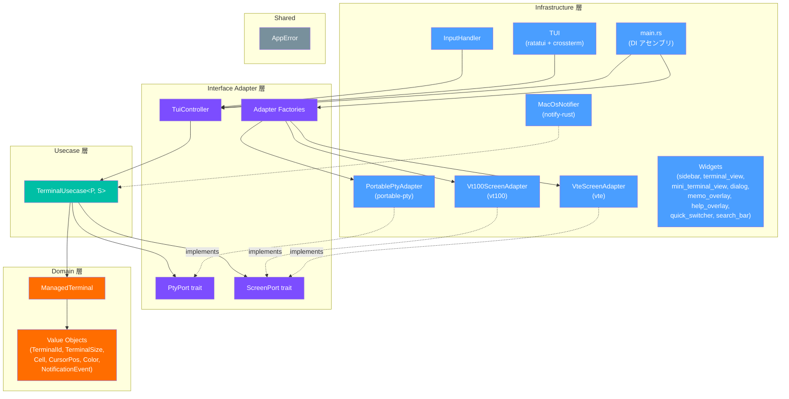

# CLI Manager

TUI ベースのターミナルマルチプレクサ。複数の CLI プロセス（例: Claude Code）を擬似端末（PTY）で管理し、2 ペインの TUI インターフェースで切り替えながら操作できる、"CLI プロセス用ウィンドウマネージャ" です。

## 目次

- [機能](#機能)
- [必要環境](#必要環境)
- [インストール](#インストール)
- [クイックスタート](#クイックスタート)
- [操作方法](#操作方法)
  - [キーバインド一覧](#キーバインド一覧)
  - [Visual 選択モード（ヤンクバッファ）](#visual-選択モードヤンクバッファ)
  - [クイックスイッチャー](#クイックスイッチャー)
  - [ミニターミナル](#ミニターミナル)
  - [プレフィックスキーの仕組み](#プレフィックスキーの仕組み)
- [UI レイアウト](#ui-レイアウト)
- [ターミナルのライフサイクル](#ターミナルのライフサイクル)
- [アーキテクチャ](#アーキテクチャ)
  - [レイヤー構成](#レイヤー構成)
  - [データフロー](#データフロー)
  - [ディレクトリ構成](#ディレクトリ構成)
- [開発](#開発)
  - [ビルド & テスト](#ビルド--テスト)
  - [テスト構成](#テスト構成)
- [技術スタック](#技術スタック)
- [ライセンス](#ライセンス)

## 機能

| 機能 | 説明 |
|------|------|
| ターミナル作成 | 新しいシェルセッションを PTY 上で起動 |
| ターミナル切替 | 番号指定・前後移動でアクティブターミナルを切り替え |
| リアルタイム出力 | ANSI カラー/エスケープシーケンスを解釈して描画 |
| サイドバー | 全ターミナルの一覧・ステータス・動的 CWD を常時表示 |
| ターミナル削除 | 実行中プロセスの場合は確認ダイアログ付き |
| プレフィックスキー | tmux ライクな `Ctrl+b` プレフィックスモデル |
| 256 色 & 属性 | xterm-256color、太字/イタリック/下線/取り消し線/反転/薄字 |
| 代替画面バッファ | vim 等のフルスクリーンアプリケーション対応 |
| スクロールリージョン | DECSTBM による部分スクロール |
| ワイド文字 | CJK 文字（全角）の正確な表示 |
| アプリケーションカーソルキー | DECCKM モード対応 |
| ブラケットペースト | ペースト時のエスケープシーケンスラッピング |
| OSC 7 動的 CWD | シェルの現在ディレクトリをサイドバーに反映 |
| 通知 | BEL / OSC 9 / OSC 777 検出 → サイドバーマーク + macOS デスクトップ通知 |
| スクロールバック | 出力履歴を vim ライクなキーバインドでスクロール閲覧（10,000 行バッファ） |
| スクロールバック検索 | `/` でインクリメンタル検索。`n` / `N` でマッチ間ジャンプ。メイン・ミニターミナル両対応 |
| ヤンクバッファ | スクロールバック中に `y` / `Y` で行コピー、`v` / `V` で Visual 選択。`Ctrl+b` → `]` で別ターミナルにペースト |
| リネーム | ターミナル名を後から変更可能 |
| メモ | 各ターミナルに複数行メモを付与・編集。サイドバーに `[≡]` インジケータ表示 |
| ヘルプオーバーレイ | `Ctrl+b` → `?` でキーバインド一覧をオーバーレイ表示 |
| クイックスイッチャー | `Ctrl+b` → `f` でファジー検索オーバーレイ。名前・CWD・メモで絞り込み即座に切替 |
| ミニターミナル | フッター型クイックシェル。`` Ctrl+b `` → `` ` `` でトグル。スクロールバック対応 |

## 必要環境

- **Rust** 1.85.0 以上（edition 2024 / let-chains 構文のため）
- **OS**: macOS（Linux は将来対応予定）

## インストール

```bash
git clone <repository-url>
cd cli_manager
cargo install --path .
```

`~/.cargo/bin/cm` にインストールされます。`~/.cargo/bin` にパスが通っていれば、どこからでも `cm` で起動できます。

手動でビルドする場合:

```bash
cargo build --release
```

ビルド後のバイナリは `target/release/cm` に生成されます。

## クイックスタート

```bash
# インストール済みの場合
cm

# または cargo 経由で起動
cargo run
```

起動すると TUI が表示されます。最初のターミナルを作成するには `Ctrl+b` → `c` を押してください。

## 操作方法

### キーバインド一覧

すべての操作コマンドは **プレフィックスキー `Ctrl+b`** の後に入力します。

| キーバインド | アクション |
|---|---|
| `Ctrl+b` → `c` | 新しいターミナルを作成 |
| `Ctrl+b` → `d` | アクティブターミナルを削除（実行中なら確認あり） |
| `Ctrl+b` → `n` | 次のターミナルを選択 |
| `Ctrl+b` → `p` | 前のターミナルを選択 |
| `Ctrl+b` → `1`〜`9` | 番号指定でターミナルをジャンプ |
| `Ctrl+b` → `f` | クイックスイッチャーを開く（ファジー検索で切替） |
| `Ctrl+b` → `Ctrl+b` | 子プロセスに `Ctrl+b` を送信 |
| `Ctrl+b` → `[` | スクロールバックモードに入る |
| `Ctrl+b` → `r` | アクティブターミナルをリネーム |
| `Ctrl+b` → `m` | メモを編集 |
| `Ctrl+b` → `` ` `` | ミニターミナルのトグル（開く/閉じる/フォーカス切替） |
| `Ctrl+b` → `]` | ヤンクバッファの内容をペースト（Bracketed Paste 対応） |
| `Ctrl+b` → `?` | ヘルプオーバーレイを表示 |
| `Ctrl+b` → `q` | アプリケーション終了 |
| その他のキー | アクティブターミナルの stdin へパススルー |

#### スクロールバックモード

`Ctrl+b` → `[` でスクロールバックモードに入ると、出力履歴を遡って閲覧できます。vim ライクなキーバインドで操作します。

| キーバインド | アクション |
|---|---|
| `↑` / `k` | 1 行上にスクロール |
| `↓` / `j` | 1 行下にスクロール |
| `PageUp` | 1 ページ上にスクロール |
| `PageDown` | 1 ページ下にスクロール |
| `g` | バッファの先頭にジャンプ |
| `G` | バッファの末尾にジャンプ |
| `Esc` / `q` | スクロールバックモードを終了 |
| `/` | 検索モードに入る（インクリメンタル検索） |
| `y` | 先頭表示行をヤンクバッファにコピー |
| `Y` | 表示中の全行をヤンクバッファにコピー |
| `v` | Visual 文字選択モードに入る |
| `V` | Visual 行選択モードに入る |
| `n` | 次のマッチにジャンプ（検索確定後） |
| `N` | 前のマッチにジャンプ（検索確定後） |
| `Enter` | 検索を確定し、`n` / `N` でのナビゲーションモードへ移行 |
| `Esc` | 検索をキャンセル（検索中は検索終了、その後もう一度で通常モードへ） |

**検索の使い方:**

1. スクロールバックモード（`Ctrl+b` → `[`）に入る
2. `/` を押して検索クエリを入力（大文字小文字を区別しない）
3. 入力中はリアルタイムでマッチ箇所がハイライト表示される
4. `Enter` で検索を確定 → `n` / `N` でマッチ間をジャンプ
5. `Esc` で検索を終了しスクロールバックモードに戻る

検索バーはメインペイン下部に表示され、`[現在/総数]` 形式でマッチ数が確認できます。メインターミナルとミニターミナルの両方で利用可能です。

#### Visual 選択モード（ヤンクバッファ）

スクロールバックモード中に `v`（文字選択）または `V`（行選択）で Visual 選択モードに入ります。tmux の copy-mode に相当する機能で、テキストを選択・コピーし、別のターミナルにペーストできます。

| キーバインド | アクション |
|---|---|
| `h` / `←` | カーソルを左に移動 |
| `l` / `→` | カーソルを右に移動 |
| `j` / `↓` | カーソルを下に移動 |
| `k` / `↑` | カーソルを上に移動 |
| `0` | 行頭にジャンプ |
| `$` | 行末にジャンプ |
| `PageUp` | ページ上に移動 |
| `PageDown` | ページ下に移動 |
| `y` | 選択範囲をヤンク → スクロールバックに戻る |
| `Esc` | 選択をキャンセル → スクロールバックに戻る |

**使い方:**

1. スクロールバックモード（`Ctrl+b` → `[`）に入る
2. `v`（文字選択）または `V`（行選択）で Visual モードに入る
3. `hjkl` / 矢印キーでカーソルを移動し、選択範囲を調整（青ハイライトで表示）
4. `y` で選択範囲をヤンクバッファにコピー → "Yanked!" が 2 秒間表示
5. 別のターミナルに切り替え、`Ctrl+b` → `]` でペースト

**特徴:**
- 選択範囲は青背景でハイライト表示、カーソル位置は白背景で表示
- 表示範囲外にカーソルが出ると自動スクロール
- Bracketed Paste Mode に対応（vim 等へのペーストも正常に動作）
- 検索ハイライトと選択ハイライトが共存する場合、検索ハイライトが優先
- メインターミナルとミニターミナルの両方で利用可能

#### リネーム

`Ctrl+b` → `r` でリネームダイアログが開きます。現在の名前がプリセットされた状態で編集でき、`Enter` で確定、`Esc` でキャンセルします。

#### メモ編集

`Ctrl+b` → `m` でメモ編集オーバーレイが開きます。各ターミナルにメモを付けて用途や作業内容を記録できます。

| キーバインド | アクション |
|---|---|
| 文字入力 | テキストを入力 |
| `Ctrl+J` | 改行を挿入 |
| `↑` / `↓` | カーソルを行間移動 |
| `←` / `→` | カーソルを左右移動 |
| `Backspace` | 文字削除（行頭では前行と結合） |
| `Enter` | メモを保存して閉じる |
| `Esc` | 変更を破棄して閉じる |

メモが存在するターミナルにはサイドバーに `[≡]` インジケータが表示されます。メモはセッション中のみ保持されます。

#### ミニターミナル

`Ctrl+b` → `` ` `` でフッター領域にミニターミナルを開きます。メインターミナルを操作しながら、ちょっとしたコマンドを実行するのに便利です。

- **3 ステートトグル:** 1 回目で開く → 2 回目でメインにフォーカスを戻す → 3 回目で閉じる
- **独立した PTY:** メインターミナルとは別のシェルセッション（`$SHELL` を起動）
- **スクロールバック対応:** `Ctrl+b` → `[` でスクロールバックモードに入り、メインと同じキーバインドで履歴を閲覧可能
- **OSC 7 CWD:** ミニターミナルも動的 CWD に対応
- **自動クリーンアップ:** ミニターミナル内のプロセスが終了すると自動的に閉じる

#### クイックスイッチャー

`Ctrl+b` → `f` でクイックスイッチャーオーバーレイが表示されます。ターミナル一覧をファジー検索で絞り込み、素早く切り替えられます。VS Code の `Ctrl+P` や tmux の `choose-tree` に相当する機能です。

| キーバインド | アクション |
|---|---|
| 文字入力 | インクリメンタルにフィルタ |
| `↑` / `Ctrl+k` | 選択カーソルを上に移動 |
| `↓` / `Ctrl+j` | 選択カーソルを下に移動 |
| `Enter` | 選択ターミナルに切り替え |
| `Esc` | キャンセル（何も変更しない） |

**検索対象:** ターミナル ID、名前、動的 CWD、メモ。マッチした文字は Cyan + Bold でハイライト表示されます。

#### ヘルプオーバーレイ

`Ctrl+b` → `?` でヘルプオーバーレイが表示されます。全キーバインドを TERMINAL / NAVIGATION / SCROLLBACK / GENERAL の 4 カテゴリに分類して一覧表示します。`?` または `Esc` で閉じます。

### プレフィックスキーの仕組み

`Ctrl+b` は tmux と同じプレフィックスキーです。InputHandler が以下のステートマシンで管理します。


**ポイント:**
- `Ctrl+b` を押すと 1 秒間コマンド入力を待機します
- 1 秒以内にコマンドキーを押さなかった場合、`Ctrl+b` が子プロセスにそのまま送られます
- 子プロセスに `Ctrl+b` 自体を送りたい場合は `Ctrl+b` → `Ctrl+b` と 2 回押します

## UI レイアウト

2 ペイン構成のインターフェースです。`Ctrl+b` → `` ` `` でフッター領域にミニターミナルが追加されます。

```
┌───────────────────────┬────────────────────────────────────┐
│ Terminals          3  │                                    │
│───────────────────────│ ~/projects/my-app                  │
│ ● 1: my-app          │ $ claude "テストを書いて"            │
│   /projects/my-app    │                                    │
│   claude running      │ 了解です。テストを作成します。        │
│───────────────────────│ src/lib.rs を読んでいます...         │
│ ○ 2: api-srv [≡]     │                                    │
│   /projects/api       │ テストを書きました：                 │
│   idle                │ - test_create_task                  │
│───────────────────────│ - test_delete_task                  │
│ ✗ 3: frontend      * │                                    │
│   /projects/front     │                                    │
│   exited (0)          │                                    │
│                       │                                    │
│───────────────────────│                                    │
│ ^b ?:Help q:Quit      │ $ _                                │
│                       ├────────────────────────────────────┤
│                       │ Mini Terminal          ~/projects  │
│                       │ $ git status                       │
│                       │ On branch main                     │
│                       │ $ _                                │
└───────────────────────┴────────────────────────────────────┘
  ← サイドバー (25文字) →  ← メインペイン (残り幅) →
                                  ↑ ミニターミナル (高さ10行)
```


### サイドバーのステータスアイコン

| アイコン | ステータス | 意味 |
|---------|-----------|------|
| `●` | Running | プロセス実行中 |
| `○` | Idle | アイドル状態 |
| `✗` | Exited | プロセス終了済み（出力は保持） |
| `*` | 通知あり | 未読通知（BEL / OSC 9 / OSC 777） |
| `[≡]` | メモあり | ターミナルにメモが付与されている |

## ターミナルのライフサイクル

ターミナルは以下の状態遷移で管理されます。


**状態の説明:**

| 状態 | 説明 |
|------|------|
| **Created** | ターミナル作成直後。PTY が割り当てられる |
| **Running** | シェルプロセスが実行中。キー入力を受け付ける |
| **Exited** | プロセスが終了。出力は保持され閲覧可能 |
| **Removed** | ユーザーが明示的に削除。リストから除去される |

## アーキテクチャ

クリーンアーキテクチャに基づき、厳密な依存方向を維持しています。

### レイヤー構成



**依存方向:** `Infrastructure → Interface Adapter → Usecase → Domain`（内側ほど依存が少ない）

| レイヤー | 責務 | 外部クレート依存 |
|---------|------|----------------|
| **Domain** | エンティティ・値オブジェクト | なし（純粋 Rust） |
| **Usecase** | ターミナル管理ロジック | なし（ポートトレイトのみ） |
| **Interface Adapter** | ポートトレイト定義・コントローラ・ファクトリ | なし |
| **Infrastructure** | 具象実装（PTY, 画面, TUI, 通知, DI） | ratatui, crossterm, portable-pty, vte, vt100, notify-rust |
| **Shared** | エラー型 | thiserror |

### データフロー

ユーザー入力から画面描画までの一連の流れです。


### ディレクトリ構成

```
src/
├── main.rs                              # DI アセンブリ & エントリーポイント
├── domain/                              # Domain 層
│   ├── model/
│   │   └── terminal.rs                  # ManagedTerminal エンティティ
│   └── primitive/                       # 値オブジェクト
│       ├── terminal_id.rs               # TerminalId
│       ├── terminal_status.rs           # TerminalStatus
│       ├── terminal_size.rs             # TerminalSize
│       ├── cell.rs                      # Cell, CursorPos, Color
│       ├── notification.rs              # NotificationEvent (Bell/Osc9/Osc777)
│       └── search_match.rs             # SearchMatch (スクロールバック検索結果)
├── usecase/
│   └── terminal_usecase.rs              # TerminalUsecase<P: PtyPort, S: ScreenPort>
├── interface_adapter/                   # Interface Adapter 層
│   ├── port/
│   │   ├── pty_port.rs                  # PtyPort トレイト
│   │   └── screen_port.rs              # ScreenPort トレイト
│   ├── adapter/
│   │   ├── pty_adapter_factory.rs       # PTY アダプタファクトリ
│   │   └── screen_adapter_factory.rs    # Screen アダプタファクトリ
│   └── controller/
│       └── tui_controller.rs            # TuiController (AppAction ディスパッチ)
├── infrastructure/                      # Infrastructure 層
│   ├── pty/
│   │   └── portable_pty_adapter.rs      # PtyPort 実装 (portable-pty)
│   ├── screen/
│   │   ├── vte_screen.rs               # ScreenPort 実装 (vte)
│   │   ├── vt100_screen.rs             # ScreenPort 実装 (vt100)
│   │   └── osc7.rs                     # OSC 7 URI パーサー
│   ├── tui/
│   │   ├── app_runner.rs                # メインイベントループ
│   │   ├── input.rs                     # InputHandler (キー入力処理)
│   │   ├── fuzzy_matcher.rs             # ファジーマッチエンジン (クイックスイッチャー用)
│   │   └── widgets/                     # UI ウィジェット
│   │       ├── layout.rs                # 2ペインレイアウト
│   │       ├── sidebar.rs               # サイドバー (ターミナル一覧 + 通知マーク)
│   │       ├── terminal_view.rs         # メインペイン (出力表示 + ワイド文字)
│   │       ├── mini_terminal_view.rs   # ミニターミナル (フッター型クイックシェル)
│   │       ├── dialog.rs                # 確認・リネームダイアログ
│   │       ├── memo_overlay.rs          # メモ編集オーバーレイ
│   │       ├── help_overlay.rs          # ヘルプオーバーレイ
│   │       ├── quick_switcher.rs        # クイックスイッチャーオーバーレイ
│   │       └── search_bar.rs           # スクロールバック検索バー
│   └── notification/
│       └── macos_notifier.rs            # macOS デスクトップ通知 (notify-rust)
└── shared/
    └── error.rs                         # AppError enum
```

## 開発

### ビルド & テスト

```bash
# 型チェック
cargo check

# ビルド
cargo build

# テスト（全 1037 件）
cargo test

# 特定のテストのみ実行
cargo test test_create_terminal

# Lint
cargo clippy
```

### テスト構成

合計 **1037** ユニットテスト。各モジュールごとの内訳は以下の通りです。


| モジュール | テスト数 | テスト対象 |
|-----------|---------|-----------|
| `AppRunner` | 196 | イベントループ、スクロールバック（メイン/ミニ）、フォーカス制御、ミニターミナル管理、クイックスイッチャー統合、スクロールバック検索、ヤンクバッファ、Visual 選択モード |
| `VteScreenAdapter` | 177 | ANSI パース、セルグリッド、カーソル移動、代替画面、スクロールリージョン、ワイド文字、OSC タイトル、通知 |
| `Vt100ScreenAdapter` | 124 | vt100 ベースパース、セル属性、OSC 7 CWD、OSC タイトル、通知、スクロールバック、カーソルスタイル、DSR 応答、スクロールバック検索、get_row_cells |
| `InputHandler` | 112 | ステートマシン、プレフィックスキー、タイムアウト、アプリケーションカーソルキー、ブラケットペースト、スクロールバックモード、検索モード、メモ編集モード、ヘルプ表示、ミニターミナル入力、ヤンク/Visual/ペーストキーバインド |
| `TerminalView` | 75 | 出力表示、ワイド文字クリッピング、カーソル位置、スクロールバック表示、検索ハイライト、選択ハイライト、ステータスメッセージ |
| `TerminalUsecase` | 61 | CRUD 操作、ポーリング、通知収集、リネーム、メモ操作、エラーハンドリング |
| `TuiController` | 48 | AppAction ディスパッチ、状態管理、リネーム・メモ・ヘルプ・ミニターミナル・クイックスイッチャー・検索・ヤンク/ペースト/Visual 操作 |
| `MiniTerminalView` | 40 | ミニターミナル描画、セルグリッド、ワイド文字、カーソル位置、スクロールバック表示、検索ハイライト、選択ハイライト、ステータスメッセージ |
| `QuickSwitcher` | 40 | オーバーレイ描画、クエリ入力、選択ハイライト、マッチ文字ハイライト、スクロール、小画面対応 |
| `Sidebar` | 32 | ターミナル一覧描画、動的 CWD 表示、通知マーク、メモインジケータ |
| `HelpOverlay` | 20 | ヘルプオーバーレイ描画、カテゴリ表示、キーバインド一覧、検索・ヤンク・Visual キーバインド表示、小画面対応 |
| `ManagedTerminal` | 17 | エンティティ操作、通知フラグ、リネーム、メモ |
| `MacOsNotifier` | 17 | デスクトップ通知送信、レート制限 |
| `NotificationEvent` | 15 | Bell/Osc9/Osc777 イベント |
| `FuzzyMatcher` | 13 | サブシーケンスマッチ、スコアリング、フィルタ＆ソート、日本語、エッジケース |
| `SearchBar` | 11 | 検索バー描画、マッチカウンタ表示、スタイリング |
| `Dialog` | 11 | 確認・リネームダイアログ描画 |
| `Layout` | 10 | 2ペインレイアウト計算、ミニターミナル分割 |
| `OSC 7 Parser` | 10 | URI パース、パーセントデコード |
| `Cell` | 5 | セル属性、色 |
| `MemoOverlay` | 3 | メモ編集オーバーレイ描画 |

**モックパターン（スレッドセーフ）:**
- `MockPtyPort`: `Arc<Mutex<>>` で呼び出し履歴を追跡（Send+Sync 対応）
- `MockScreenPort`: `&mut self` メソッドのため plain フィールドで安全

## 技術スタック

| クレート | バージョン | 用途 |
|---------|-----------|------|
| [ratatui](https://ratatui.rs/) | 0.30 | TUI フレームワーク |
| [crossterm](https://github.com/crossterm-rs/crossterm) | 0.29 | ターミナルバックエンド（bracketed-paste feature 有効） |
| [portable-pty](https://github.com/wez/wezterm/tree/main/pty) | 0.9 | PTY 管理 |
| [vte](https://github.com/alacritty/vte) | 0.15 | ANSI エスケープパーサー |
| [vt100](https://github.com/doy/vt100-rust) | 0.16 | VT100 ターミナルエミュレータ（代替 ScreenPort 実装） |
| [unicode-width](https://github.com/unicode-rs/unicode-width) | 0.2 | ワイド文字（CJK 等）の表示幅判定 |
| [notify-rust](https://github.com/hoodie/notify-rust) | 4 | macOS デスクトップ通知 |
| [thiserror](https://github.com/dtolnay/thiserror) | 2.0 | エラー型定義 |
| [anyhow](https://github.com/dtolnay/anyhow) | 1.0 | エラー伝播 |
| [libc](https://github.com/rust-lang/libc) | 0.2 | 低レベル PTY 操作（non-blocking I/O） |

## ライセンス

MIT
