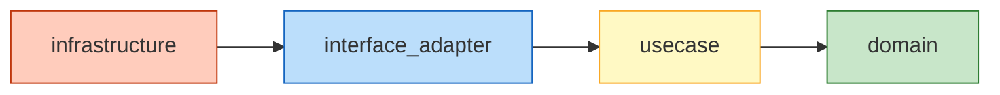
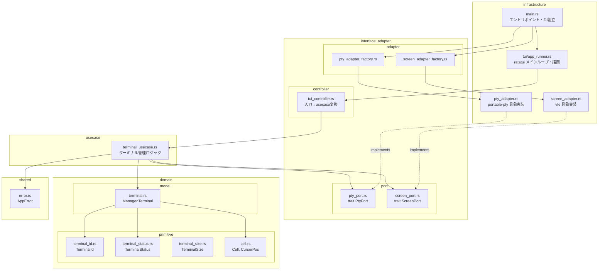
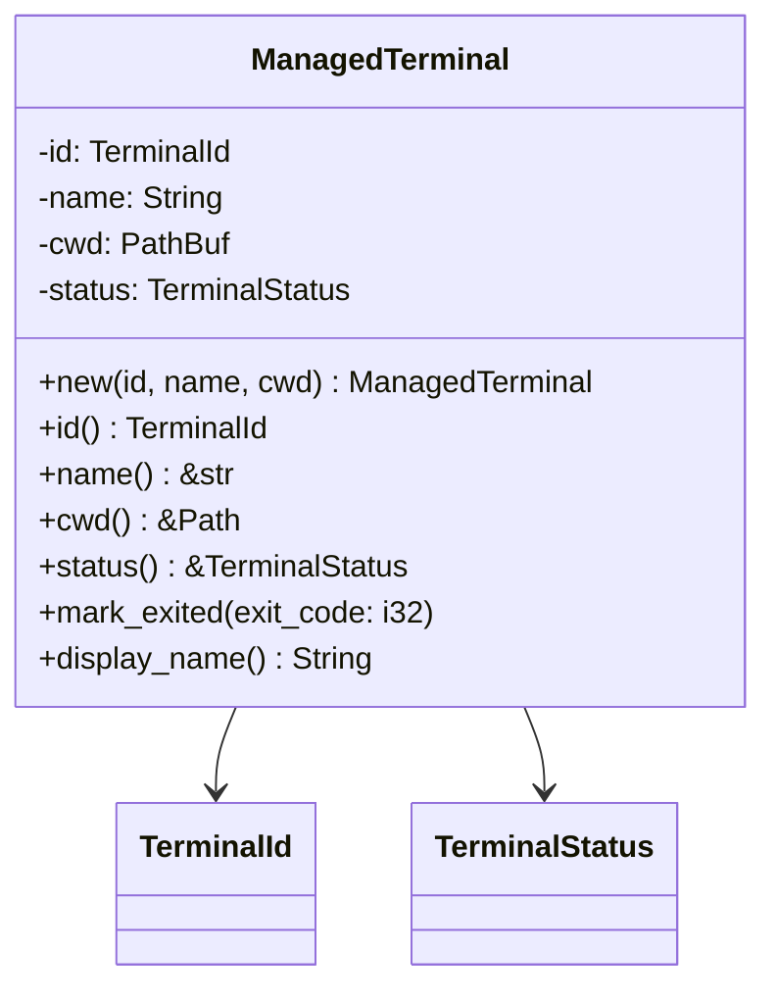
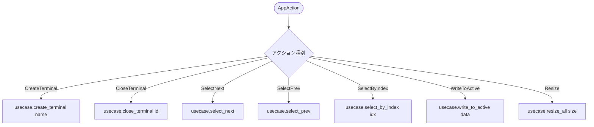
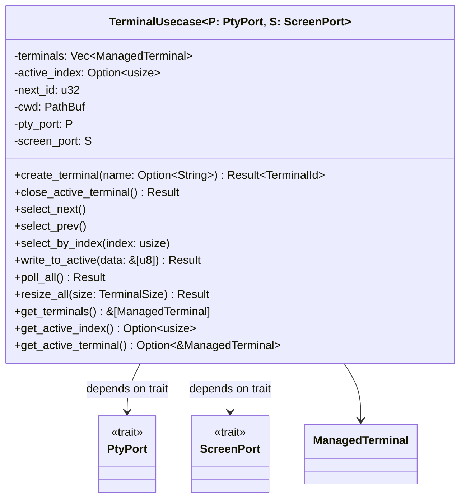
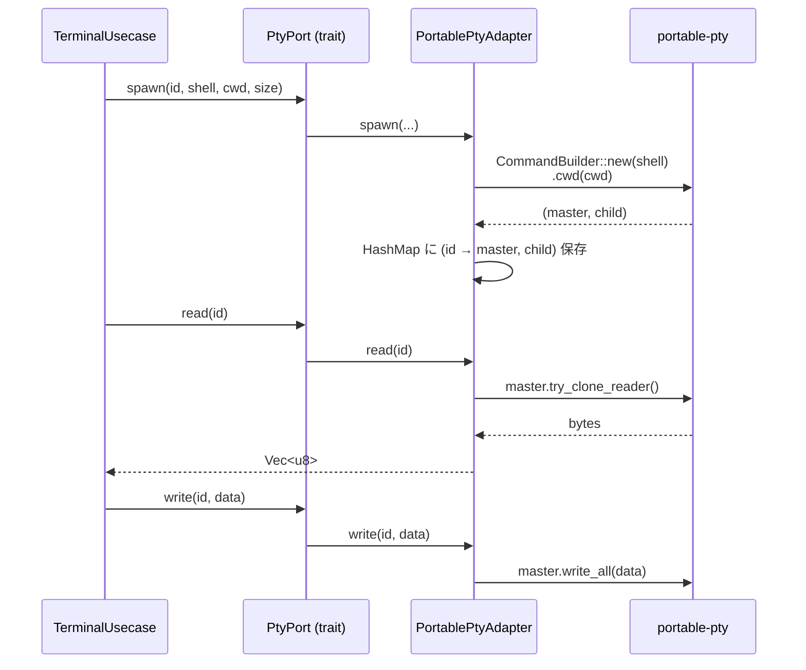
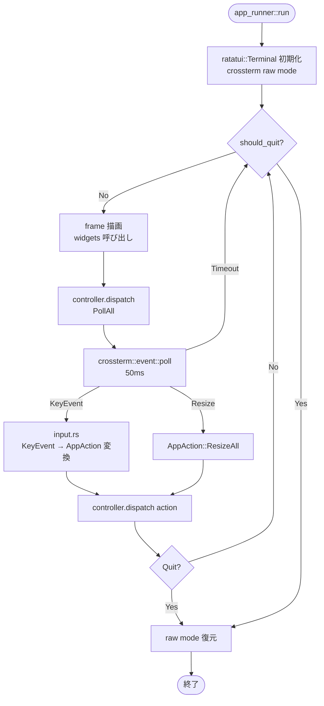
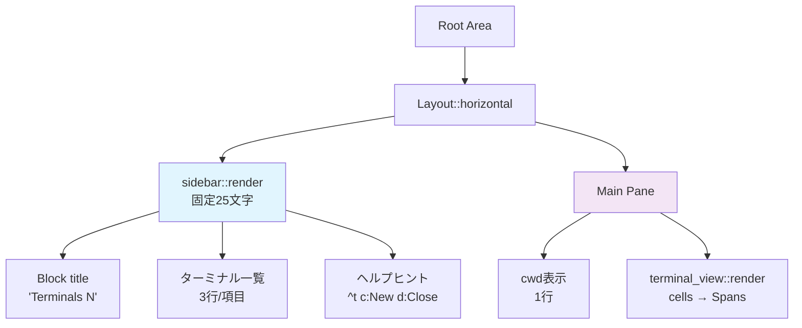
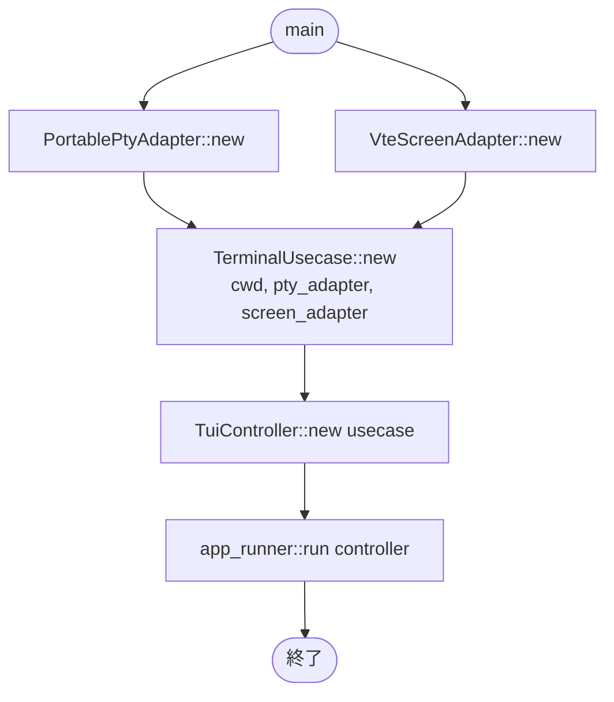

# CLI Manager - 詳細設計書

## 1. アーキテクチャ概要

### 1.1 クリーンアーキテクチャ依存方向



**依存ルール: 外側 → 内側 のみ許可。逆方向は禁止。**

### 1.2 各層の責務（本プロジェクトにおける定義）

| 層 | 責務 | 参照可能 |
|------|------|----------|
| `domain` | ターミナルエンティティ、値オブジェクト、ビジネスルール | なし（最内層） |
| `usecase` | ターミナル管理のビジネスロジック（作成・削除・選択・入出力転送） | domain, port(trait) |
| `interface_adapter` | port定義(trait)、adapter実装、TUI controller | domain, usecase |
| `infrastructure` | pty具象実装、vte画面バッファ、crossterm/ratatui、エントリポイント | 全層 |
| `shared` | エラー型、設定 | domain のみ |

### 1.3 コンポーネント関係図



### 1.4 ディレクトリ構成

```
cli_manager/
├── Cargo.toml
├── docs/
│   ├── requirements.md
│   └── detailed-design.md
└── src/
    ├── main.rs                          # エントリポイント・DI組立
    ├── domain/
    │   ├── mod.rs
    │   ├── model/
    │   │   ├── mod.rs
    │   │   └── terminal.rs              # ManagedTerminal エンティティ
    │   └── primitive/
    │       ├── mod.rs
    │       ├── terminal_id.rs           # TerminalId 値オブジェクト
    │       ├── terminal_status.rs       # TerminalStatus 値オブジェクト
    │       ├── terminal_size.rs         # TerminalSize 値オブジェクト
    │       └── cell.rs                  # Cell, CursorPos 値オブジェクト
    ├── usecase/
    │   ├── mod.rs
    │   └── terminal_usecase.rs          # ターミナル管理ユースケース
    ├── interface_adapter/
    │   ├── mod.rs
    │   ├── port/
    │   │   ├── mod.rs
    │   │   ├── pty_port.rs              # trait PtyPort
    │   │   └── screen_port.rs           # trait ScreenPort
    │   ├── adapter/
    │   │   ├── mod.rs
    │   │   ├── pty_adapter_factory.rs   # PtyPort ファクトリ
    │   │   └── screen_adapter_factory.rs # ScreenPort ファクトリ
    │   └── controller/
    │       ├── mod.rs
    │       └── tui_controller.rs        # TUI入力 → usecase呼び出し
    ├── infrastructure/
    │   ├── mod.rs
    │   ├── pty/
    │   │   ├── mod.rs
    │   │   └── portable_pty_adapter.rs  # PtyPort の portable-pty 実装
    │   ├── screen/
    │   │   ├── mod.rs
    │   │   └── vte_screen.rs            # ScreenPort の vte 実装
    │   └── tui/
    │       ├── mod.rs
    │       ├── app_runner.rs            # ratatui メインループ
    │       ├── input.rs                 # キー入力処理・プレフィックスモード
    │       └── widgets/
    │           ├── mod.rs
    │           ├── layout.rs            # 2ペインレイアウト
    │           ├── sidebar.rs           # サイドバー描画
    │           ├── terminal_view.rs     # ターミナルペイン描画
    │           └── dialog.rs            # ダイアログ描画
    └── shared/
        ├── mod.rs
        └── error.rs                     # AppError 定義
```

---

## 2. domain層

### 2.1 設計原則

- 外部クレートへの依存なし（Pure Rust のみ）
- ビジネスルール・不変条件をモデル化
- `vte`, `portable-pty`, `ratatui` 等は一切参照しない

### 2.2 値オブジェクト（primitive/）

```rust
// domain/primitive/terminal_id.rs
#[derive(Debug, Clone, Copy, PartialEq, Eq, Hash)]
pub struct TerminalId(u32);

impl TerminalId {
    pub fn new(value: u32) -> Self { Self(value) }
    pub fn value(&self) -> u32 { self.0 }
}
```

```rust
// domain/primitive/terminal_status.rs
#[derive(Debug, Clone, PartialEq, Eq)]
pub enum TerminalStatus {
    Running,
    Exited(i32),
}

impl TerminalStatus {
    pub fn is_running(&self) -> bool {
        matches!(self, Self::Running)
    }

    pub fn icon(&self) -> &str {
        match self {
            Self::Running => "●",
            Self::Exited(_) => "✗",
        }
    }
}
```

```rust
// domain/primitive/terminal_size.rs
#[derive(Debug, Clone, Copy, PartialEq, Eq)]
pub struct TerminalSize {
    pub cols: u16,
    pub rows: u16,
}
```

```rust
// domain/primitive/cell.rs
#[derive(Debug, Clone, Copy, PartialEq, Eq)]
pub enum Color {
    Default,
    Indexed(u8),
    Rgb(u8, u8, u8),
}

#[derive(Debug, Clone, Copy)]
pub struct Cell {
    pub ch: char,
    pub fg: Color,
    pub bg: Color,
    pub bold: bool,
    pub underline: bool,
}

impl Default for Cell {
    fn default() -> Self {
        Self {
            ch: ' ',
            fg: Color::Default,
            bg: Color::Default,
            bold: false,
            underline: false,
        }
    }
}

#[derive(Debug, Clone, Copy, Default)]
pub struct CursorPos {
    pub row: u16,
    pub col: u16,
}
```

### 2.3 エンティティ（model/）



```rust
// domain/model/terminal.rs
use std::path::{Path, PathBuf};
use crate::domain::primitive::{TerminalId, TerminalStatus};

pub struct ManagedTerminal {
    id: TerminalId,
    name: String,
    cwd: PathBuf,
    status: TerminalStatus,
}

impl ManagedTerminal {
    pub fn new(id: TerminalId, name: String, cwd: PathBuf) -> Self {
        Self {
            id,
            name,
            cwd,
            status: TerminalStatus::Running,
        }
    }

    pub fn id(&self) -> TerminalId { self.id }
    pub fn name(&self) -> &str { &self.name }
    pub fn cwd(&self) -> &Path { &self.cwd }
    pub fn status(&self) -> &TerminalStatus { &self.status }

    pub fn mark_exited(&mut self, exit_code: i32) {
        self.status = TerminalStatus::Exited(exit_code);
    }

    /// サイドバー表示用: "1: my-app"
    pub fn display_name(&self) -> String {
        format!("{}: {}", self.id.value(), self.name)
    }
}
```

---

## 3. interface_adapter層

### 3.1 Port定義（port/）

usecase層が依存するインターフェース。具象実装はinfrastructure層に置く。

```rust
// interface_adapter/port/pty_port.rs
use crate::domain::primitive::{TerminalId, TerminalSize};
use crate::shared::error::AppError;
use std::path::Path;

pub trait PtyPort: Send + Sync {
    /// シェルプロセスをpty上で起動し、識別用のidを紐付ける
    fn spawn(
        &mut self,
        id: TerminalId,
        shell: &str,
        cwd: &Path,
        size: TerminalSize,
    ) -> Result<(), AppError>;

    /// 指定ターミナルのptyからnon-blockingで読み取り
    fn read(&mut self, id: TerminalId) -> Result<Vec<u8>, AppError>;

    /// 指定ターミナルのptyに書き込み
    fn write(&mut self, id: TerminalId, data: &[u8]) -> Result<(), AppError>;

    /// 指定ターミナルのptyをリサイズ
    fn resize(&mut self, id: TerminalId, size: TerminalSize) -> Result<(), AppError>;

    /// プロセス終了を確認（non-blocking）
    fn try_wait(&mut self, id: TerminalId) -> Result<Option<i32>, AppError>;

    /// プロセスを強制終了しリソース解放
    fn kill(&mut self, id: TerminalId) -> Result<(), AppError>;
}
```

```rust
// interface_adapter/port/screen_port.rs
use crate::domain::primitive::{Cell, CursorPos, TerminalId, TerminalSize};
use crate::shared::error::AppError;

pub trait ScreenPort: Send + Sync {
    /// 指定ターミナルの画面バッファを初期化
    fn create(&mut self, id: TerminalId, size: TerminalSize) -> Result<(), AppError>;

    /// バイト列をANSIパースして画面バッファに反映
    fn process(&mut self, id: TerminalId, data: &[u8]) -> Result<(), AppError>;

    /// 画面バッファの内容を取得
    fn get_cells(&self, id: TerminalId) -> Result<&Vec<Vec<Cell>>, AppError>;

    /// カーソル位置を取得
    fn get_cursor(&self, id: TerminalId) -> Result<CursorPos, AppError>;

    /// 画面バッファをリサイズ
    fn resize(&mut self, id: TerminalId, size: TerminalSize) -> Result<(), AppError>;

    /// 画面バッファを削除
    fn remove(&mut self, id: TerminalId) -> Result<(), AppError>;
}
```

### 3.2 Controller（controller/）

TUI入力イベントをusecaseの呼び出しに変換する。



```rust
// interface_adapter/controller/tui_controller.rs
use crate::usecase::terminal_usecase::TerminalUsecase;
use crate::domain::primitive::TerminalSize;
use crate::shared::error::AppError;

/// TUI層から受け取るアクション（infrastructure非依存）
pub enum AppAction {
    CreateTerminal { name: Option<String> },
    CloseTerminal,
    SelectNext,
    SelectPrev,
    SelectByIndex(usize),
    WriteToActive(Vec<u8>),
    ResizeAll(TerminalSize),
    PollAll,
    Quit,
}

pub struct TuiController<P: PtyPort, S: ScreenPort> {
    usecase: TerminalUsecase<P, S>,
}

impl<P: PtyPort, S: ScreenPort> TuiController<P, S> {
    pub fn new(usecase: TerminalUsecase<P, S>) -> Self {
        Self { usecase }
    }

    pub fn dispatch(&mut self, action: AppAction) -> Result<(), AppError> {
        match action {
            AppAction::CreateTerminal { name } => {
                self.usecase.create_terminal(name)?;
            }
            AppAction::CloseTerminal => {
                self.usecase.close_active_terminal()?;
            }
            AppAction::SelectNext => self.usecase.select_next(),
            AppAction::SelectPrev => self.usecase.select_prev(),
            AppAction::SelectByIndex(idx) => self.usecase.select_by_index(idx),
            AppAction::WriteToActive(data) => {
                self.usecase.write_to_active(&data)?;
            }
            AppAction::ResizeAll(size) => {
                self.usecase.resize_all(size)?;
            }
            AppAction::PollAll => {
                self.usecase.poll_all()?;
            }
            AppAction::Quit => {}
        }
        Ok(())
    }

    pub fn usecase(&self) -> &TerminalUsecase<P, S> {
        &self.usecase
    }
}
```

### 3.3 Adapter Factory（adapter/）

```rust
// interface_adapter/adapter/pty_adapter_factory.rs
use crate::interface_adapter::port::pty_port::PtyPort;
use crate::infrastructure::pty::portable_pty_adapter::PortablePtyAdapter;

pub fn create_pty_adapter() -> impl PtyPort {
    PortablePtyAdapter::new()
}
```

```rust
// interface_adapter/adapter/screen_adapter_factory.rs
use crate::interface_adapter::port::screen_port::ScreenPort;
use crate::infrastructure::screen::vte_screen::VteScreenAdapter;

pub fn create_screen_adapter() -> impl ScreenPort {
    VteScreenAdapter::new()
}
```

---

## 4. usecase層

### 4.1 TerminalUsecase

Port（trait）経由でのみ外部アクセスする。具象型を直接参照しない。



```rust
// usecase/terminal_usecase.rs
use std::path::PathBuf;
use crate::domain::model::terminal::ManagedTerminal;
use crate::domain::primitive::*;
use crate::interface_adapter::port::pty_port::PtyPort;
use crate::interface_adapter::port::screen_port::ScreenPort;
use crate::shared::error::AppError;

pub struct TerminalUsecase<P: PtyPort, S: ScreenPort> {
    terminals: Vec<ManagedTerminal>,
    active_index: Option<usize>,
    next_id: u32,
    cwd: PathBuf,
    pty_port: P,
    screen_port: S,
}

impl<P: PtyPort, S: ScreenPort> TerminalUsecase<P, S> {
    pub fn new(cwd: PathBuf, pty_port: P, screen_port: S) -> Self {
        Self {
            terminals: Vec::new(),
            active_index: None,
            next_id: 1,
            cwd,
            pty_port,
            screen_port,
        }
    }

    /// ターミナル作成
    /// 1. ID採番
    /// 2. 名前決定（未指定なら自動命名）
    /// 3. pty起動（port経由）
    /// 4. 画面バッファ作成（port経由）
    /// 5. エンティティ作成・リスト追加
    /// 6. アクティブ切替
    pub fn create_terminal(
        &mut self,
        name: Option<String>,
        size: TerminalSize,
    ) -> Result<TerminalId, AppError> {
        let id = TerminalId::new(self.next_id);
        self.next_id += 1;

        let name = name.unwrap_or_else(|| format!("term-{}", id.value()));
        let shell = std::env::var("SHELL").unwrap_or_else(|_| "/bin/sh".to_string());

        self.pty_port.spawn(id, &shell, &self.cwd, size)?;
        self.screen_port.create(id, size)?;

        let terminal = ManagedTerminal::new(id, name, self.cwd.clone());
        self.terminals.push(terminal);
        self.active_index = Some(self.terminals.len() - 1);

        Ok(id)
    }

    /// アクティブターミナル削除
    /// 1. Running中ならptyをkill
    /// 2. 画面バッファ削除
    /// 3. リストから削除
    /// 4. active_index調整
    pub fn close_active_terminal(&mut self) -> Result<(), AppError> {
        let index = self.active_index.ok_or(AppError::NoActiveTerminal)?;
        let terminal = &self.terminals[index];
        let id = terminal.id();

        if terminal.status().is_running() {
            self.pty_port.kill(id)?;
        }
        self.screen_port.remove(id)?;
        self.terminals.remove(index);

        // active_index 調整
        if self.terminals.is_empty() {
            self.active_index = None;
        } else if index >= self.terminals.len() {
            self.active_index = Some(self.terminals.len() - 1);
        }

        Ok(())
    }

    /// 全ptyをポーリングし、出力を画面バッファに反映
    /// プロセス終了を検知したらエンティティのstatusを更新
    pub fn poll_all(&mut self) -> Result<(), AppError> {
        for terminal in &mut self.terminals {
            let id = terminal.id();

            // 出力読み取り → 画面反映
            match self.pty_port.read(id) {
                Ok(data) if !data.is_empty() => {
                    self.screen_port.process(id, &data)?;
                }
                Ok(_) => {}
                Err(e) => {
                    terminal.mark_exited(-1);
                    continue;
                }
            }

            // プロセス終了チェック
            if terminal.status().is_running() {
                if let Ok(Some(code)) = self.pty_port.try_wait(id) {
                    terminal.mark_exited(code);
                }
            }
        }
        Ok(())
    }

    pub fn write_to_active(&mut self, data: &[u8]) -> Result<(), AppError> {
        let id = self.get_active_terminal()
            .ok_or(AppError::NoActiveTerminal)?
            .id();
        self.pty_port.write(id, data)
    }

    pub fn resize_all(&mut self, size: TerminalSize) -> Result<(), AppError> {
        for terminal in &self.terminals {
            let id = terminal.id();
            let _ = self.pty_port.resize(id, size);
            let _ = self.screen_port.resize(id, size);
        }
        Ok(())
    }

    pub fn select_next(&mut self) {
        if let Some(ref mut idx) = self.active_index {
            if !self.terminals.is_empty() {
                *idx = (*idx + 1) % self.terminals.len();
            }
        }
    }

    pub fn select_prev(&mut self) {
        if let Some(ref mut idx) = self.active_index {
            if !self.terminals.is_empty() {
                *idx = idx.checked_sub(1).unwrap_or(self.terminals.len() - 1);
            }
        }
    }

    pub fn select_by_index(&mut self, index: usize) {
        if index < self.terminals.len() {
            self.active_index = Some(index);
        }
    }

    // --- Read accessors (UI描画用) ---

    pub fn get_terminals(&self) -> &[ManagedTerminal] {
        &self.terminals
    }

    pub fn get_active_index(&self) -> Option<usize> {
        self.active_index
    }

    pub fn get_active_terminal(&self) -> Option<&ManagedTerminal> {
        self.active_index.map(|i| &self.terminals[i])
    }

    pub fn screen_port(&self) -> &S {
        &self.screen_port
    }
}
```

---

## 5. infrastructure層

### 5.1 pty具象実装



```rust
// infrastructure/pty/portable_pty_adapter.rs

use std::collections::HashMap;
use crate::domain::primitive::{TerminalId, TerminalSize};
use crate::interface_adapter::port::pty_port::PtyPort;
use crate::shared::error::AppError;

struct PtyInstance {
    master: Box<dyn portable_pty::MasterPty + Send>,
    child: Box<dyn portable_pty::Child + Send>,
    reader: Box<dyn std::io::Read + Send>,
    writer: Box<dyn std::io::Write + Send>,
}

pub struct PortablePtyAdapter {
    instances: HashMap<TerminalId, PtyInstance>,
}

impl PtyPort for PortablePtyAdapter {
    fn spawn(&mut self, id: TerminalId, shell: &str, cwd: &Path, size: TerminalSize)
        -> Result<(), AppError> { /* ... */ }
    fn read(&mut self, id: TerminalId) -> Result<Vec<u8>, AppError> { /* ... */ }
    fn write(&mut self, id: TerminalId, data: &[u8]) -> Result<(), AppError> { /* ... */ }
    fn resize(&mut self, id: TerminalId, size: TerminalSize) -> Result<(), AppError> { /* ... */ }
    fn try_wait(&mut self, id: TerminalId) -> Result<Option<i32>, AppError> { /* ... */ }
    fn kill(&mut self, id: TerminalId) -> Result<(), AppError> { /* ... */ }
}
```

### 5.2 画面バッファ具象実装

```rust
// infrastructure/screen/vte_screen.rs

use std::collections::HashMap;
use crate::domain::primitive::*;
use crate::interface_adapter::port::screen_port::ScreenPort;
use crate::shared::error::AppError;

struct ScreenInstance {
    cells: Vec<Vec<Cell>>,
    cursor: CursorPos,
    size: TerminalSize,
    parser: vte::Parser,
    // SGR state
    current_fg: Color,
    current_bg: Color,
    current_bold: bool,
}

pub struct VteScreenAdapter {
    screens: HashMap<TerminalId, ScreenInstance>,
}

impl ScreenPort for VteScreenAdapter {
    fn create(&mut self, id: TerminalId, size: TerminalSize) -> Result<(), AppError> { /* ... */ }
    fn process(&mut self, id: TerminalId, data: &[u8]) -> Result<(), AppError> { /* ... */ }
    fn get_cells(&self, id: TerminalId) -> Result<&Vec<Vec<Cell>>, AppError> { /* ... */ }
    fn get_cursor(&self, id: TerminalId) -> Result<CursorPos, AppError> { /* ... */ }
    fn resize(&mut self, id: TerminalId, size: TerminalSize) -> Result<(), AppError> { /* ... */ }
    fn remove(&mut self, id: TerminalId) -> Result<(), AppError> { /* ... */ }
}
```

### 5.3 TUI（ratatui + crossterm）

TUI関連は全てinfrastructure層に閉じ込める。

#### 5.3.1 app_runner.rs - メインループ



#### 5.3.2 input.rs - キー入力→AppAction変換

```mermaid
stateDiagram-v2
    [*] --> Normal
    Normal --> PrefixWait: Ctrl+b 入力
    Normal --> Normal: Other → AppAction::WriteToActive

    PrefixWait --> Normal: 'c' → AppAction::CreateTerminal
    PrefixWait --> Normal: 'd' → AppAction::CloseTerminal
    PrefixWait --> Normal: 'n' → AppAction::SelectNext
    PrefixWait --> Normal: 'p' → AppAction::SelectPrev
    PrefixWait --> Normal: '1'-'9' → AppAction::SelectByIndex
    PrefixWait --> Normal: Ctrl+b → AppAction::WriteToActive(Ctrl+b)
    PrefixWait --> Normal: Timeout(1s) → AppAction::WriteToActive(Ctrl+b)
    PrefixWait --> Normal: Other → cancel (no action)
```

```rust
// infrastructure/tui/input.rs

use std::time::Instant;
use crossterm::event::{KeyCode, KeyEvent, KeyModifiers};
use crate::interface_adapter::controller::tui_controller::AppAction;

pub enum InputMode {
    Normal,
    PrefixWait(Instant),
    DialogInput,
}

pub struct InputHandler {
    mode: InputMode,
}

impl InputHandler {
    /// KeyEvent を受け取り、AppAction に変換
    /// None を返す場合はアクションなし（キャンセル等）
    pub fn handle_key(&mut self, key: KeyEvent) -> Option<AppAction> {
        match &self.mode {
            InputMode::Normal => self.handle_normal(key),
            InputMode::PrefixWait(since) => self.handle_prefix(key, *since),
            InputMode::DialogInput => None, // dialog側で処理
        }
    }

    pub fn check_timeout(&mut self) -> Option<AppAction> {
        if let InputMode::PrefixWait(since) = &self.mode {
            if since.elapsed().as_millis() > 1000 {
                self.mode = InputMode::Normal;
                return Some(AppAction::WriteToActive(vec![0x02])); // Ctrl+b
            }
        }
        None
    }
}
```

#### 5.3.3 widgets/ - 描画ウィジェット



描画関数はusecase層の読み取り用メソッド（`get_terminals`, `get_active_index`, `screen_port().get_cells()`）を参照して描画する。ratatui固有の型はこの層に閉じる。

---

## 6. shared層

### 6.1 エラー型

```rust
// shared/error.rs
use crate::domain::primitive::TerminalId;

#[derive(thiserror::Error, Debug)]
pub enum AppError {
    #[error("Failed to spawn pty: {0}")]
    PtySpawn(#[source] std::io::Error),

    #[error("Pty I/O error for terminal {id}: {source}")]
    PtyIo {
        id: TerminalId,
        #[source]
        source: std::io::Error,
    },

    #[error("Terminal not found: {0}")]
    TerminalNotFound(TerminalId),

    #[error("Screen not found: {0}")]
    ScreenNotFound(TerminalId),

    #[error("No active terminal")]
    NoActiveTerminal,

    #[error("TUI error: {0}")]
    Tui(#[source] std::io::Error),
}
```

---

## 7. DI組立（main.rs）



```rust
// main.rs
use crate::infrastructure::pty::portable_pty_adapter::PortablePtyAdapter;
use crate::infrastructure::screen::vte_screen::VteScreenAdapter;
use crate::usecase::terminal_usecase::TerminalUsecase;
use crate::interface_adapter::controller::tui_controller::TuiController;
use crate::infrastructure::tui::app_runner;

fn main() -> anyhow::Result<()> {
    let cwd = std::env::current_dir()?;

    // Infrastructure 具象生成
    let pty_adapter = PortablePtyAdapter::new();
    let screen_adapter = VteScreenAdapter::new();

    // Usecase 生成（trait経由で依存）
    let usecase = TerminalUsecase::new(cwd, pty_adapter, screen_adapter);

    // Controller 生成
    let controller = TuiController::new(usecase);

    // TUI実行
    app_runner::run(controller)?;

    Ok(())
}
```

---

## 8. 依存クレート

| クレート | バージョン | 用途 | 配置層 |
|----------|-----------|------|--------|
| `ratatui` | 0.30.0 | TUIフレームワーク | infrastructure |
| `crossterm` | 0.29.0 | ターミナルバックエンド | infrastructure |
| `portable-pty` | 0.9.0 | pty管理 | infrastructure |
| `vte` | 0.15.0 | ANSIエスケープパーサー | infrastructure |
| `thiserror` | 2.0.18 | エラー型定義 | shared |
| `anyhow` | 1.0.101 | エラー伝播（main） | infrastructure(main) |

- **Rust edition: 2024**
- **domain/usecase層は外部クレートに依存しない。**

---

## 9. 実装順序

```mermaid
gantt
    title MVP実装フェーズ（クリーンアーキテクチャ）
    dateFormat X
    axisFormat %s

    section Phase 1: domain + shared
    shared/error.rs                         :p1, 0, 1
    domain/primitive/ (全値オブジェクト)       :p2, 0, 1
    domain/model/terminal.rs                :p3, 1, 2

    section Phase 2: port + usecase
    port/pty_port.rs                        :p4, 2, 3
    port/screen_port.rs                     :p5, 2, 3
    usecase/terminal_usecase.rs             :p6, 3, 5

    section Phase 3: infrastructure 具象
    infrastructure/pty/portable_pty_adapter  :p7, 5, 7
    infrastructure/screen/vte_screen         :p8, 5, 7

    section Phase 4: controller + TUI
    controller/tui_controller.rs             :p9, 7, 8
    infrastructure/tui/input.rs              :p10, 7, 8
    infrastructure/tui/widgets/*             :p11, 8, 10
    infrastructure/tui/app_runner.rs         :p12, 10, 11

    section Phase 5: DI + 統合
    main.rs (DI組立)                         :p13, 11, 12
    adapter/factory                          :p14, 11, 12
    結合テスト・バグ修正                       :p15, 12, 14
```



### Phase 1: domain + shared（内側から作る）

1. `shared/error.rs` - AppError定義
2. `domain/primitive/` - TerminalId, TerminalStatus, TerminalSize, Cell, CursorPos
3. `domain/model/terminal.rs` - ManagedTerminal

### Phase 2: port + usecase

4. `interface_adapter/port/pty_port.rs` - PtyPort trait
5. `interface_adapter/port/screen_port.rs` - ScreenPort trait
6. `usecase/terminal_usecase.rs` - 全ビジネスロジック（この時点ではport traitのみに依存）

### Phase 3: infrastructure具象

7. `infrastructure/pty/portable_pty_adapter.rs` - PtyPort実装
8. `infrastructure/screen/vte_screen.rs` - ScreenPort実装

### Phase 4: controller + TUI

9. `interface_adapter/controller/tui_controller.rs` - AppAction → usecase呼び出し
10. `infrastructure/tui/input.rs` - KeyEvent → AppAction変換
11. `infrastructure/tui/widgets/` - sidebar, terminal_view, dialog, layout
12. `infrastructure/tui/app_runner.rs` - メインループ

### Phase 5: DI + 統合

13. `main.rs` - DI組立
14. `interface_adapter/adapter/` - ファクトリ
15. 結合テスト・エッジケース修正
