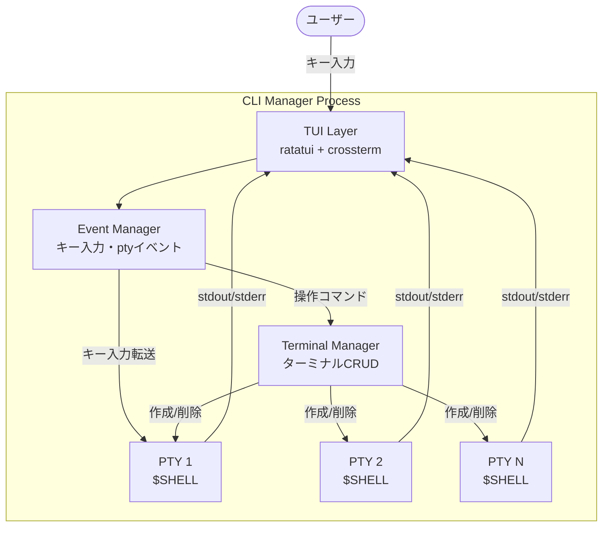
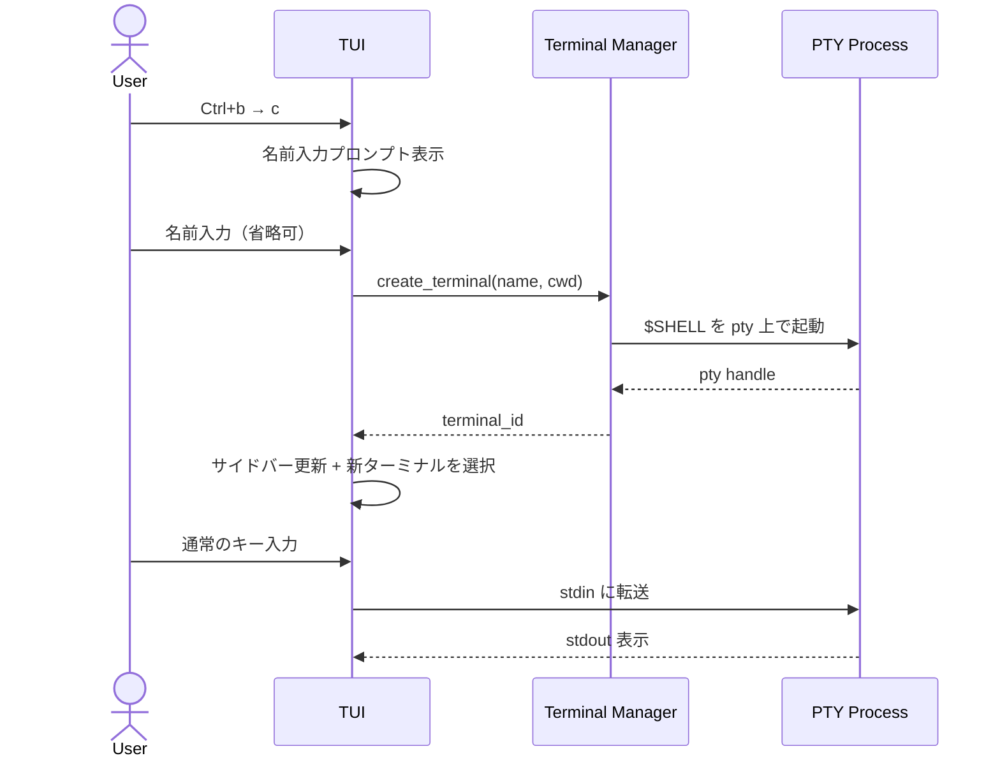
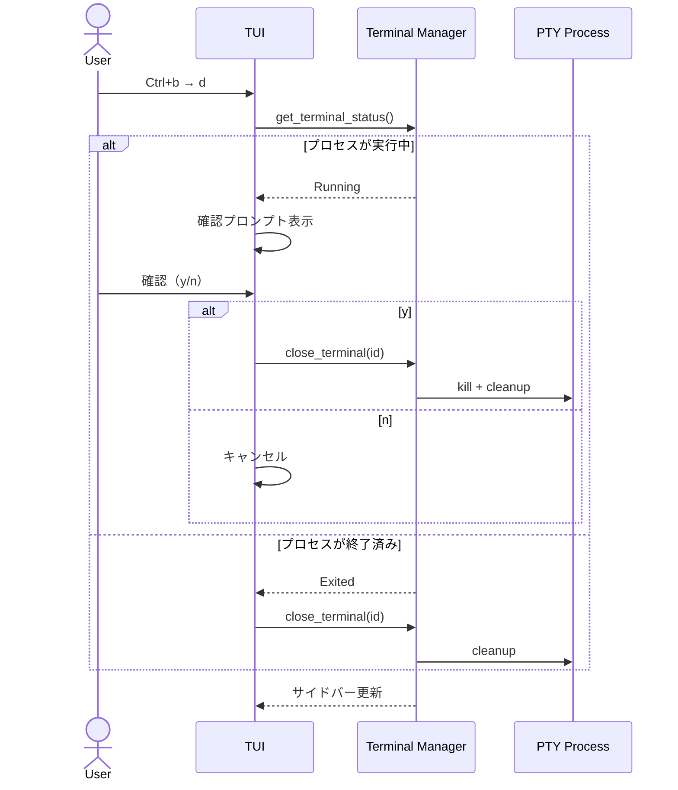
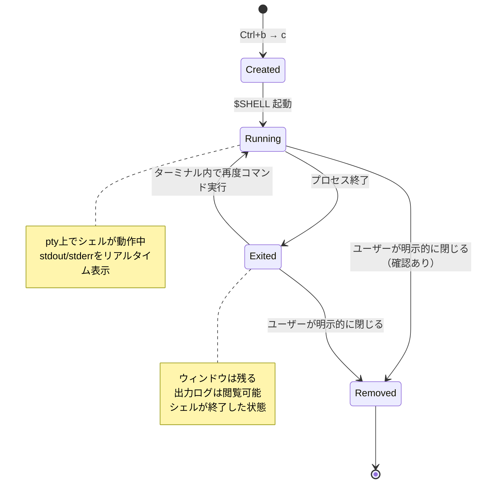
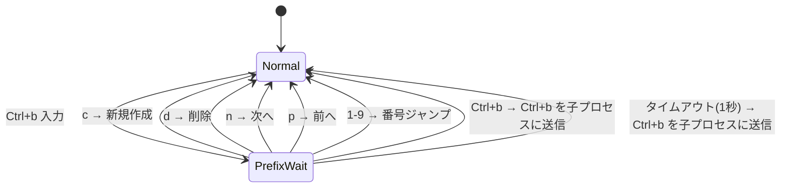

# CLI Manager - 要件定義書

## 1. 概要

CLIプロセスをTUIで一元管理するターミナルマルチプレクサ。
複数の対話型CLIプロセス（Claude Code等）を同時に起動し、TUI上で切り替えながら操作できる。

### 1.1 コンセプト

**「CLIプロセスのウィンドウマネージャー」**

- 各タスク = 擬似ターミナル（pty）上のシェルプロセス
- タスクは空のシェルとして作成され、ユーザーが自由にコマンドを入力
- タスクは明示的に閉じるまで残り続ける（プロセス終了後もウィンドウは残る）

### 1.2 技術スタック

| 項目 | 選定 |
|------|------|
| 言語 | Rust (edition 2024) |
| TUIフレームワーク | ratatui 0.30 + crossterm 0.29 |
| pty管理 | portable-pty 0.9 |
| ANSIパーサー | vte 0.15 |
| エラーハンドリング | thiserror 2.0 + anyhow 1.0 |
| ターゲットOS | macOS（初期）、将来Linux |

---

## 2. システム構成



---

## 3. 機能要件

### F1: ターミナル一覧表示（サイドバー）

左サイドバーに全ターミナルの一覧を常時表示する。

**表示項目:**

| 項目 | 内容 | 例 |
|------|------|----|
| 状態アイコン | `●` Running / `○` Idle / `✗` Exited | `●` |
| 番号 + 名前 | 連番とユーザー指定 or 自動命名 | `1: my-app` |
| 作業ディレクトリ | 省略表示 | `/projects/my-app` |
| プロセス状態 | 現在の状態テキスト | `claude running` |

- サイドバー幅: 約25文字
- ターミナル総数をヘッダーに表示
- 選択中のターミナルをハイライト

### F2: ターミナル作成



- 名前: 任意（省略時は `term-1`, `term-2`... で自動命名）
- 作業ディレクトリ: CLI Manager の起動ディレクトリ（シェル内で `cd` して変更）
- 起動シェル: `$SHELL`（ユーザーのデフォルトシェル）

### F3: ターミナル選択・切り替え

- キーバインドで前後・番号指定で切り替え
- 切り替え時に右ペインの表示が即座に更新

### F4: ターミナルとのインタラクション

- 選択中のターミナルに対してキー入力を送信（stdin → pty）
- pty 経由で stdout/stderr をリアルタイム受信・表示
- ANSI エスケープシーケンス対応（色、カーソル制御）
- `Ctrl+C` 等のシグナルも pty を通じて子プロセスに送信可能

### F5: ターミナル削除



### F6: タスクライフサイクル



---

## 4. UIレイアウト

### 4.1 2ペイン構成

```
┌───────────────────────┬────────────────────────────────────┐
│ Terminals          3  │                                    │
│───────────────────────│ ~/projects/my-app                  │
│ ● 1: my-app          │ $ claude "テストを書いて"            │
│   /projects/my-app    │                                    │
│   claude running      │ 了解です。テストを作成します。        │
│───────────────────────│ src/lib.rs を読んでいます...         │
│ ○ 2: api-srv         │                                    │
│   /projects/api       │ テストを書きました：                 │
│   idle                │ - test_create_task                  │
│───────────────────────│ - test_delete_task                  │
│ ✗ 3: frontend        │                                    │
│   /projects/front     │                                    │
│   exited (0)          │                                    │
│                       │                                    │
│───────────────────────│                                    │
│ ^t c:New d:Close      │ $ _                                │
│ ↑↓:Sel               │                                    │
└───────────────────────┴────────────────────────────────────┘
```

### 4.2 レイアウト仕様

| 要素 | 仕様 |
|------|------|
| サイドバー幅 | 固定 25 文字 |
| サイドバー位置 | 左 |
| ターミナル表示 | 右ペイン（残り全幅） |
| 区切り線 | 縦線で分離 |
| ヘルプ表示 | サイドバー最下部にキーバインドヒント |

---

## 5. キーバインド

プレフィックス方式: `Ctrl+b` をプレフィックスキーとする。

| キー | アクション |
|------|-----------|
| `Ctrl+b → c` | 新規ターミナル作成 |
| `Ctrl+b → d` | 選択中のターミナルを閉じる |
| `Ctrl+b → n` | 次のターミナルへ |
| `Ctrl+b → p` | 前のターミナルへ |
| `Ctrl+b → 1-9` | 番号指定でターミナル切り替え |
| `Ctrl+b → Ctrl+b` | `Ctrl+b` を子プロセスに送信 |
| その他全キー入力 | アクティブなターミナルにそのまま送信 |

### 5.1 プレフィックスの挙動



---

## 6. 同時実行

- 同時実行数の制限なし
- 全ターミナルの pty プロセスは独立して並列動作
- リソース管理は利用者の責任

---

## 7. 非機能要件

| 項目 | 要件 |
|------|------|
| パフォーマンス | 大量の stdout 出力でも TUI がフリーズしない（バッファリング・描画スロットリング） |
| リサイズ対応 | ターミナルサイズ変更時に pty 側にも WINSIZE を伝播 |
| 文字コード | UTF-8 対応 |
| ANSI対応 | 色・カーソル制御等の ANSI エスケープシーケンス |

---

## 8. MVP外（将来拡張）

| 機能 | 概要 |
|------|------|
| リネーム | ターミナル名を後から変更 |
| スクロールバック | 出力履歴のスクロール |
| サイドバー折りたたみ | 全画面モード切り替え |
| 設定ファイル | タスク定義の保存・再利用 |
| ログ永続化 | 実行ログのファイル保存 |
| ソート・フィルタ | ターミナル一覧の並び替え・絞り込み |
| 通知 | プロセス終了時等の通知 |
